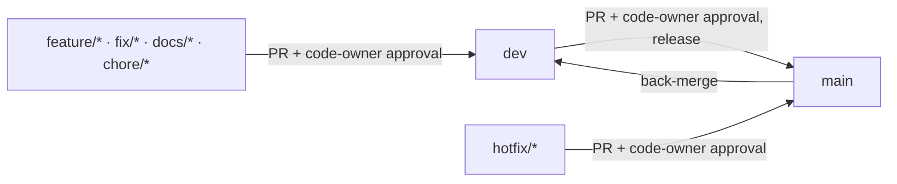

# Contributing to LocaQL

Thanks for your interest in LocaQL. This document explains how to report issues, propose changes, and get a pull request merged.

## Table of Contents

- [Code of Conduct](#code-of-conduct)
- [Before You Start](#before-you-start)
- [Reporting Bugs and Requesting Features](#reporting-bugs-and-requesting-features)
- [Development Setup](#development-setup)
- [Branching Model and DevOps Cycle](#branching-model-and-devops-cycle)
- [Commit Message Convention](#commit-message-convention)
- [Pull Request Process](#pull-request-process)
- [Branch Protection: Who Can Approve and Merge](#branch-protection-who-can-approve-and-merge)
- [License and Attribution](#license-and-attribution)

## Code of Conduct

Be respectful and constructive. Disagree on technical merits, not on people. Harassment, personal attacks, and discriminatory language are not tolerated and will result in comments being removed, contributions rejected, or repository access revoked at the maintainer's discretion.

## Before You Start

- For anything beyond a small fix or a documentation typo, **open an issue first** and describe the problem or proposal before writing code. This avoids wasted effort on changes that don't fit the project's scope.
- Check the [Current Scope Matrix](README.md#current-scope-matrix) and `capabilities/registry.yaml` first — they're the source of truth for what's already supported, partial, or explicitly out of scope (e.g., IAM/policies).
- Compatibility-affecting changes must not invent BigQuery fields, error codes, or behavior that don't exist in the real API. When in doubt, cite the official REST/Discovery documentation in your issue or PR description.

## Reporting Bugs and Requesting Features

Use GitHub Issues:

- **Bug report**: what you did, what you expected, what actually happened, emulator version/commit, and (if relevant) the exact request/response involved.
- **Feature request**: the BigQuery contract or workflow you want supported, why it matters, and whether it's already listed as `planned`/`unsupported` in `capabilities/registry.yaml`.

Issue templates are provided under `.github/ISSUE_TEMPLATE/` to prompt for this information.

## Development Setup

- WSL distribution `Ubuntu-24.04`, Go 1.24.9+ (see [Requirements](README.md#requirements) — `GOTOOLCHAIN=auto` downloads it automatically).
- Build and test everything through WSL, not native Windows, since race tests need `build-essential`/cgo:

```bash
wsl -d Ubuntu-24.04 -- bash -lc 'cd /mnt/f/GitHub/LocaQL && go build ./... && go test ./...'
```

- See [Quick Start (WSL)](README.md#quick-start-wsl) and [Test](README.md#test) in the README for running the emulator, the conformance suite, and the race-detector build.

## Branching Model and DevOps Cycle

LocaQL uses a lightweight GitFlow-style model: an integration branch (`dev`) and a release branch (`main`), with short-lived branches feeding into whichever one matches the change's impact.

| Branch prefix | Use it for | Branches from | Merges into |
| --- | --- | --- | --- |
| `feature/*` | New functionality | `dev` | `dev` |
| `fix/*` | Non-urgent bug fixes | `dev` | `dev` |
| `docs/*` | Documentation-only changes | `dev` | `dev` |
| `chore/*` | Tooling, deps, refactors with no behavior change | `dev` | `dev` |
| `hotfix/*` | Urgent fix for a bug already released on `main` | `main` | `main`, then back-merged into `dev` |



Rules:

- Regular contributions target `dev`. `main` only receives merges from `dev` (releases) or from a `hotfix/*` branch (urgent fixes), never a direct feature branch.
- A `hotfix/*` branch is cut from `main`, fixes the issue, merges back into `main`, and is then back-merged (or cherry-picked) into `dev` so the two branches don't diverge.
- Both `main` and `dev` are protected: direct pushes and force-pushes are rejected for everyone except the repository owner (see [Branch Protection](#branch-protection-who-can-approve-and-merge) below).

## Commit Message Convention

Use a `type: subject` format, matching the project's existing history:

- `feat:` — new functionality.
- `fix:` — bug fix.
- `docs:` — documentation only.
- `chore:` — tooling, dependencies, non-functional maintenance.
- `refactor:` — internal restructuring with no behavior change.

Keep the subject line concise and in English; avoid referencing internal tooling in the message body.

## Pull Request Process

1. Open the PR against `dev` (or `main` for a `hotfix/*` branch only).
2. Make sure CI-equivalent checks pass locally before requesting review:
   - `go build ./...`
   - `go vet ./...`
   - `go test ./...`
   - `CGO_ENABLED=1 go test -race ./internal/server` for anything touching concurrency-sensitive code (jobs, tables, datasets services).
3. Update `capabilities/registry.yaml` and the [Current Scope Matrix](README.md#current-scope-matrix) if the change adds, closes, or changes the status of a capability.
4. Update the relevant `README.md` section (and its Table of Contents entry) if you add or rename a documented feature or endpoint.
5. Fill in the pull request template (`.github/PULL_REQUEST_TEMPLATE.md`).
6. Wait for a code-owner review. See below for exactly who that is.

## Branch Protection: Who Can Approve and Merge

`main` and `dev` are protected by a GitHub repository ruleset:

- A pull request requires **at least one approval, and that approval must come from a code owner** (`.github/CODEOWNERS` designates the repository owner as the code owner for the entire tree). An approval from any other collaborator does not, by itself, satisfy this requirement.
- Force-pushes and branch deletion are blocked on both branches.
- The repository owner is the only bypass-listed actor and can push or merge directly without going through the pull request/approval requirement. Everyone else must go through the PR process above.

This means: **anyone can open a PR against `dev` or `main`, but only the owner's approval allows it to merge** (or the owner can merge it directly).

## License and Attribution

LocaQL is licensed under the [Apache License, Version 2.0](LICENSE). Read the [`NOTICE`](NOTICE) file before using, deploying, modifying, or forking this project — it explains the attribution you're required to carry forward, and clarifies that LocaQL is not affiliated with Google or BigQuery.

By submitting a contribution, you agree it is licensed under the same terms (Apache License, Version 2.0), per [Section 5](LICENSE) of the license.
