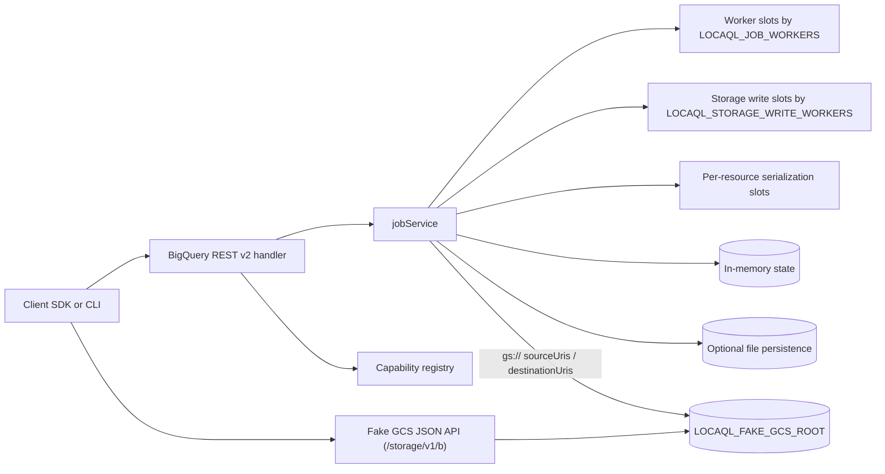
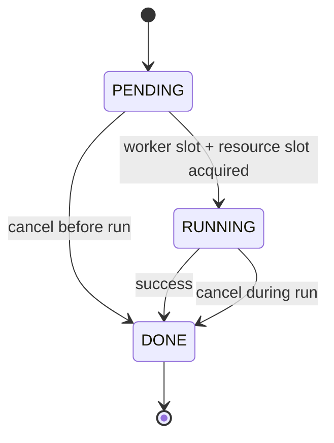
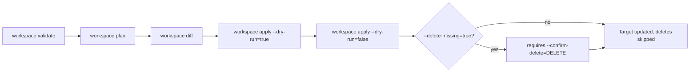
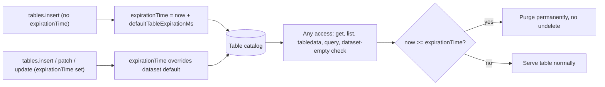
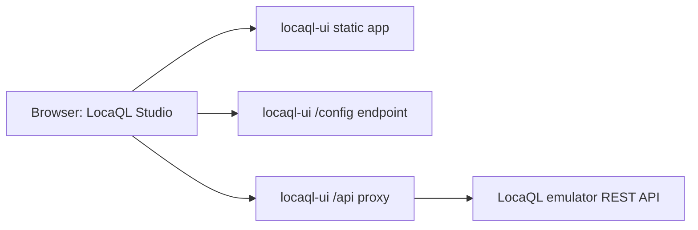

# LocaQL

LocaQL is a local BigQuery-compatible development platform.

This repository currently implements incremental scope from the master plan:
- Foundation emulator endpoints and capability registry.
- REST pagination baseline for datasets, tables, jobs, and tabledata.
- Async jobs engine with cancel, polling, idempotency (TTL), and script parent/child jobs.
- Simulated query/load/extract/copy executors with synthetic statistics.
- Configurable worker limits and resource-level serialization for conflicting job mutations.

## Table of Contents

- [Requirements](#requirements)
- [Quick Start (WSL)](#quick-start-wsl)
- [Capability Registry](#capability-registry)
- [Current Scope Matrix](#current-scope-matrix)
- [Runtime Architecture](#runtime-architecture)
- [Concurrency and Isolation Notes](#concurrency-and-isolation-notes)
- [Job State Model](#job-state-model)
- [Workspace Promotion Flow](#workspace-promotion-flow)
- [Load Jobs: Real Row Ingestion (NDJSON / CSV / Avro / Parquet)](#load-jobs-real-row-ingestion-ndjson--csv--avro--parquet)
- [Extract Jobs: Real Table Export (NDJSON / CSV / Avro / Parquet)](#extract-jobs-real-table-export-ndjson--csv--avro--parquet)
- [Dataset Lifecycle: Delete Contents and Undelete](#dataset-lifecycle-delete-contents-and-undelete)
- [Table Expiration: defaultTableExpirationMs Enforcement](#table-expiration-defaulttableexpirationms-enforcement)
- [Routines and Models: Metadata CRUD](#routines-and-models-metadata-crud)
- [External Tables: Query Local Files Without Loading](#external-tables-query-local-files-without-loading)
- [Fake GCS: A Real Cloud Storage JSON API, Locally](#fake-gcs-a-real-cloud-storage-json-api-locally)
- [Conformance Baseline](#conformance-baseline)
- [Test](#test)
- [End-to-End Console Tests](#end-to-end-console-tests)
- [LocaQL Console (Standalone UI)](#locaql-console-standalone-ui)
- [Contributing](#contributing)
- [License](#license)

## Requirements

- WSL distribution: `Ubuntu-24.04`
- Go 1.24.9+ (bumped from 1.22 to bring in `parquet-go/parquet-go` for real Parquet load/extract support; `GOTOOLCHAIN=auto`, the Go default, downloads it automatically)
- For race tests: `build-essential` (provides `gcc` for cgo).

## Quick Start (WSL)

```bash
wsl -d Ubuntu-24.04 -- bash -lc 'cd /mnt/f/GitHub/LocaQL && go run ./cmd/locaql start --addr :9050'
```

Health check:

```bash
curl http://localhost:9050/_emulator/health
```

Readiness check:

```bash
curl http://localhost:9050/_emulator/readiness
```

## Capability Registry

List loaded capabilities:

```bash
wsl -d Ubuntu-24.04 -- bash -lc 'cd /mnt/f/GitHub/LocaQL && go run ./cmd/locaql capabilities'
```

Registry file:

- `capabilities/registry.yaml`

## Current Scope Matrix

| Area | Status | Notes |
| --- | --- | --- |
| Emulator internal endpoints | Supported | `/_emulator/health`, `/_emulator/readiness`, `/_emulator/version`, `/_emulator/capabilities` |
| Dataset management | Supported | `datasets.list`, `datasets.get`, `datasets.insert`, `datasets.delete` (requires `deleteContents=true` to remove a non-empty dataset's tables), `datasets.patch` (`friendlyName`, `location`, `labels`, `defaultTableExpirationMs` — now enforced: tables lazily expire and are purged based on it, or on an explicit per-table `expirationTime` override) |
| REST pagination baseline | Supported | `datasets.list`, `tables.list`, `jobs.list`, `tabledata.list` |
| Opaque pagination tokens | Supported | `nextPageToken` is opaque; legacy numeric token input remains accepted |
| Jobs lifecycle | Supported | `PENDING -> RUNNING -> DONE`, cancel before/during run |
| requestId idempotency | Partial | Implemented for `jobs.insert` and `projects.queries` with TTL |
| Job executors (query/load/extract/copy) | Partial | Query jobs report real `outputRows`/`processedBytes` from the resolved result (`totalSlotMs` stays synthetic by design); copy jobs create real destination table data; load jobs materialize destination schema and ingest real rows from `sourceUris` (`NEWLINE_DELIMITED_JSON`, `CSV`, `AVRO` or `PARQUET`, with optional `GZIP` decompression for CSV/NDJSON); extract jobs read a real source table and write `destinationUris` in the same four formats with optional `compression` (`GZIP` for CSV/NDJSON, `SNAPPY`/`DEFLATE` for Avro, `SNAPPY`/`GZIP` for Parquet), and split into multiple real shard files once `LOCAQL_EXTRACT_SHARD_MAX_BYTES` is set and exceeded (single shard by default). `sourceUris`/`destinationUris` are local paths by default; `gs://` resolves onto a local directory only when `LOCAQL_FAKE_GCS_ROOT` is set (multi-wildcard `destinationUris` and `ORC` are rejected explicitly) |
| Routines and Models | Supported | `routines`/`models` `insert`/`get`/`list`/`patch`/`delete` are metadata-only (no SQL execution or ML training/inference backend exists; nothing is fabricated beyond stored fields) |
| External tables | Partial | `tables.insert` accepts `externalDataConfiguration` (`NEWLINE_DELIMITED_JSON`/`CSV`/`AVRO`/`PARQUET`, explicit schema, no autodetect); `sourceUris` are read fresh from disk/fake-GCS on every query/`tabledata.list`/copy/extract access rather than materialized at creation. Patching `externalDataConfiguration`, autodetect, Hive partitioning and compression options are not supported |
| Fake GCS JSON API | Partial | Buckets (insert/list/get) and objects (insert via media or multipart upload, get/download/list/delete) on the real endpoint paths, backed by `LOCAQL_FAKE_GCS_ROOT`; verified against `cloud.google.com/go/storage`. No resumable uploads, IAM, versioning, lifecycle rules, notifications, or signed URLs |
| Job persistence across restart | Partial | Optional local file persistence |
| Job concurrency limit | Partial | Controlled with `LOCAQL_JOB_WORKERS` |
| Storage Write backpressure | Partial | `load/copy` jobs throttled by `LOCAQL_STORAGE_WRITE_WORKERS` |
| Concurrent reads safety | Partial | `jobs.get` and `jobs.list` use read locks (`RWMutex`) |
| Resource mutation serialization | Partial | Conflicting mutations serialized by `project:dataset.table` |
| Catalog snapshot atomicity | Partial | Optional persisted state uses temp file replace to avoid partial commits |
| INFORMATION_SCHEMA priority | Partial | `SCHEMATA`, `SCHEMATA_OPTIONS`, `TABLES`, `COLUMNS`, `TABLE_OPTIONS`, `JOBS`, `JOBS_BY_PROJECT`, `JOBS_BY_USER`, `PARTITIONS`, `ROUTINES`, `PARAMETERS` and `MODELS` are served from the in-memory catalog; `VIEWS` returns an empty but structurally correct result (views are not a real resource yet); `MATERIALIZED_VIEWS` and `SESSIONS` are not implemented |
| Workspace validation | Supported | `locaql workspace validate` checks required portable workspace structure before promotion |
| Workspace planning and diff | Supported | `locaql workspace plan` and `locaql workspace diff` provide portable inventory and deterministic source-target delta |
| Workspace apply dry-run | Supported | `locaql workspace apply --dry-run=true` returns planned actions without mutating target |
| Workspace apply mutate | Supported | `locaql workspace apply --dry-run=false` applies planned changes; deletes require explicit `--delete-missing=true --confirm-delete=DELETE` |
| IAM and policies | Unsupported | Deliberately out of scope for local emulator parity; treated as cloud control-plane concerns |
| Standalone UI service | Supported | `cmd/locaql-ui` with dynamic capability-driven console and API proxy |
| UI resource forms | Supported | Explorer can create/update/delete datasets (with `deleteContents` retry and Undelete), create tables (native and external) and edit basic table metadata, and create/select/delete real Routines and Models, all against emulator REST endpoints; a dedicated Load/Extract tab submits real load and extract jobs. All `console.ui.*` capabilities are verified by a headless-Chrome e2e suite (see [End-to-End Console Tests](#end-to-end-console-tests)), not just by reading the code |

## Runtime Architecture



## Concurrency and Isolation Notes

- `jobs.get` and `jobs.list` use read locks while mutating paths use exclusive locks.
- Conflicting table mutations are serialized by resource key (`project:dataset.table`).
- `load/copy` jobs can be throttled independently from generic job workers through `LOCAQL_STORAGE_WRITE_WORKERS`.
- When persistence is enabled, metadata and request-id index are written in one snapshot file commit.
- Snapshot commit uses a temp file and replace strategy so failed writes do not leave partial catalog content.

## Job State Model



## Workspace Promotion Flow

The `locaql workspace` subcommands move a portable workspace from validation to a promoted target without mutating anything until `apply` runs explicitly.



## Load Jobs: Real Row Ingestion (NDJSON / CSV / Avro / Parquet)

`load` jobs materialize the destination table schema unconditionally. When `configuration.load.sourceUris` is set, the emulator also reads and ingests real rows from source files, dispatching on `sourceFormat`:

- `NEWLINE_DELIMITED_JSON`: one JSON object per line, projected onto `schema.fields` by **name**.
- `CSV`: rows mapped onto `schema.fields` by **position**; optional `fieldDelimiter` (default `,`) and `skipLeadingRows` (default `0`) are supported. Row width must match the schema field count exactly — jagged rows fail the job rather than being padded or truncated.
- `AVRO`: records read from an Avro Object Container File and projected onto `schema.fields` by **name**, same as NDJSON. The emulator does not autodetect a BigQuery schema from the file's embedded Avro schema — `schema.fields` is still required.
- `PARQUET`: rows read via [`parquet-go/parquet-go`](https://github.com/parquet-go/parquet-go) using a Parquet schema built from `schema.fields`, projected by **name** just like Avro/NDJSON. Same no-schema-autodetect limitation applies.

`sourceUris` resolve to local file paths by default (optionally prefixed with `file://`). Setting `LOCAQL_FAKE_GCS_ROOT=/some/dir` before starting the emulator makes `gs://bucket/object` URIs resolve onto `/some/dir/bucket/object` instead — a local-disk convenience mapping, **not** a GCS-compatible API. Without that env var, `gs://` is rejected explicitly.

`configuration.load.compression` (optional, default `NONE`) decompresses the source file before parsing: `GZIP` is accepted for `CSV`/`NEWLINE_DELIMITED_JSON`. Avro and Parquet already carry their own codec inside the file and are decoded transparently regardless of which one was used to write them, so `compression` is not applicable there — setting it to anything other than `NONE` for those two formats fails the job explicitly instead of silently doing nothing.

Known limitations, declared explicitly rather than silently ignored:

- Only `NEWLINE_DELIMITED_JSON`, `CSV`, `AVRO` and `PARQUET` are supported; other formats (`ORC`, the BigQuery default when `sourceFormat` is omitted) fail the job explicitly.
- `schema.fields` is required when `sourceUris` is set; there is no schema autodetect yet.
- No `maxBadRecords`/per-row error tolerance yet: any malformed row fails the whole job.
- Avro and Parquet fields are encoded as non-nullable scalars: this codebase has no NULLABLE/REQUIRED mode tracking for any format yet.

```bash
curl -X POST http://localhost:9050/bigquery/v2/projects/p1/jobs \
  -H 'Content-Type: application/json' \
  -d '{
    "configuration": {
      "load": {
        "destinationTable": {"projectId": "p1", "datasetId": "analytics", "tableId": "events"},
        "schema": {"fields": [{"name": "event_id", "type": "INT64"}, {"name": "event_name", "type": "STRING"}]},
        "sourceUris": ["/absolute/path/to/events.ndjson"],
        "sourceFormat": "NEWLINE_DELIMITED_JSON",
        "writeDisposition": "WRITE_TRUNCATE"
      }
    }
  }'
```

## Extract Jobs: Real Table Export (NDJSON / CSV / Avro / Parquet)

`extract` jobs read a real source table from the local catalog (`configuration.extract.sourceTable`) and write it to `destinationUris`, dispatching on `destinationFormat` (default `CSV` when omitted, matching the BigQuery default):

- `CSV`: `fieldDelimiter` (default `,`) and `printHeader` (default `true`, writing `schema.fields` names as the first row).
- `NEWLINE_DELIMITED_JSON`: one JSON object per row, keyed by `schema.fields` names, with `INT64`/`FLOAT64`/`BOOL` cells encoded as native JSON types rather than strings.
- `AVRO`: an Avro Object Container File with a record schema derived from `schema.fields` (`INT64`→`long`, `FLOAT64`→`double`, `BOOL`→`boolean`, else `string`).
- `PARQUET`: a Parquet file written via `parquet-go/parquet-go` using the same type mapping as Avro (`INT64`, `FLOAT64`, `BOOL`, else string).

A single `*` wildcard in `destinationUris` resolves to the BigQuery shard convention (`part-*.csv` -> `part-000000000000.csv`, `part-000000000001.csv`, ...). By default every row lands in that one shard, matching the BigQuery default of a single file when the result is small. Setting `LOCAQL_EXTRACT_SHARD_MAX_BYTES` (bytes, server-side env var, unset/`<=0` disables splitting) makes the emulator split the encoded result across multiple shard files once it exceeds that size — mirroring real BigQuery's real-size-based splitting, just with a size threshold you control locally instead of BigQuery's fixed ~1GB. A result that needs splitting requires exactly one `destinationUris` entry with a single `*`; providing a literal path (no wildcard) or more than one URI fails the job explicitly instead of silently picking one destination or writing every shard's content into the same file. The same `LOCAQL_FAKE_GCS_ROOT` mapping described above for load jobs applies to `destinationUris` too.

`configuration.extract.compression` (optional, default `NONE`) compresses the written file, with the valid codec set depending on `destinationFormat`:

| `destinationFormat` | Supported `compression` values |
| --- | --- |
| `CSV` / `NEWLINE_DELIMITED_JSON` | `NONE`, `GZIP` |
| `AVRO` | `NONE`, `SNAPPY`, `DEFLATE` (goavro's built-in OCF codecs) |
| `PARQUET` | `NONE`, `SNAPPY`, `GZIP` (`parquet-go/parquet-go`'s codec set) |

An unsupported combination (e.g. `GZIP` for `AVRO`) fails the job explicitly rather than silently falling back to uncompressed output.

Known limitations, declared explicitly rather than silently ignored:

- Only `CSV`, `NEWLINE_DELIMITED_JSON`, `AVRO` and `PARQUET` are supported as `destinationFormat`.
- `destinationUris` must be local paths, or `gs://` when `LOCAQL_FAKE_GCS_ROOT` is set; otherwise `gs://` is rejected explicitly.
- `destinationUris` with more than one `*` are rejected explicitly (only a single wildcard, resolved to one shard, is supported).
- `AVRO`'s `DEFLATE` and `PARQUET`'s `GZIP`/`SNAPPY` are the only codecs exposed; `parquet-go/parquet-go` also supports `ZSTD`/`BROTLI`/`LZ4RAW` internally but those aren't wired up as accepted `compression` values yet.

```bash
curl -X POST http://localhost:9050/bigquery/v2/projects/p1/jobs \
  -H 'Content-Type: application/json' \
  -d '{
    "configuration": {
      "extract": {
        "sourceTable": {"projectId": "p1", "datasetId": "analytics", "tableId": "events"},
        "destinationUris": ["/absolute/path/to/events_export.csv"],
        "destinationFormat": "CSV"
      }
    }
  }'
```

## Dataset Lifecycle: Delete Contents and Undelete

`datasets.delete` requires `deleteContents=true` to remove a dataset that still has tables (matching the real BigQuery contract); without it, the request fails with a 400 naming how many tables are in the way. When `deleteContents=true` is passed, the tables tracked for that dataset are removed along with the dataset itself.

```bash
curl -X DELETE "http://localhost:9050/bigquery/v2/projects/p1/datasets/warehouse?deleteContents=true"
```

`POST /_emulator/datasets/undelete` is a **LocaQL-only convenience endpoint**, deliberately kept outside the `/bigquery/v2/` namespace: BigQuery's REST API has no public dataset-undelete contract, so this is not something a real BigQuery client would ever call. It restores a dataset's metadata (`friendlyName`, `location`, `labels`, `defaultTableExpirationMs`) from the tombstone left by the most recent delete. It never restores table contents, and it fails if a dataset with the same ID already exists or if no tombstone is found.

```bash
curl -X POST http://localhost:9070/_emulator/datasets/undelete \
  -H 'Content-Type: application/json' \
  -d '{"projectId": "p1", "datasetId": "warehouse"}'
```

## Table Expiration: defaultTableExpirationMs Enforcement

A dataset's `defaultTableExpirationMs` (a duration, in milliseconds, relative to creation time) is now enforced, not just stored. Every table created without its own explicit `expirationTime` inherits an absolute expiration computed at creation time from the dataset's default. A table can also set its own `expirationTime` (an absolute Unix-millis timestamp) via `tables.insert`/`tables.patch`/`tables.update`, which overrides the dataset default, matching real BigQuery precedence.



Enforcement is lazy, not a background sweep: the first time an expired table is touched through any path (`tables.get`, `tables.list`, `tabledata.list`, query resolution, or the "is this dataset empty" check before a `deleteContents`-less delete), it is purged from the catalog and treated as if it never existed — permanently, with no undelete, matching real BigQuery (unlike dataset undelete, which does have a tombstone). A table ID freed by expiration can be reused immediately.

```bash
curl -X POST http://localhost:9050/bigquery/v2/projects/p1/datasets/warehouse/tables \
  -H 'Content-Type: application/json' \
  -d '{"tableReference": {"tableId": "temp_import"}, "expirationTime": "1798761600000"}'
```

Time is read through a swappable clock local to the table service (real `time.Now()` in production), which is how the test suite verifies expiration deterministically instead of sleeping in wall-clock time. This is a narrowly-scoped clock for table expiration specifically, not a project-wide injectable-clock abstraction — logging, sessions and time travel (all still unimplemented) would need their own.

## Routines and Models: Metadata CRUD

`routines` and `models` support `insert`/`get`/`list`/`patch`/`delete` under `bigquery/v2/projects/{p}/datasets/{d}/routines` and `.../models`. Both are **metadata-only**: there is no SQL execution engine behind routines and no ML training/inference backend behind models, so `definitionBody`/`routineType`/`language` and `modelType`/`friendlyName`/`description`/`labels` round-trip without ever being executed, trained, or scored. `trainingRuns` and evaluation metrics are never fabricated for models.

Routines also accept an optional `arguments` array (`[{"name": "x", "dataType": "INT64"}]`), surfaced through `INFORMATION_SCHEMA.PARAMETERS`. `dataType` is a flat scalar type name rather than real BigQuery's nested `StandardSqlDataType` (`{"typeKind": "INT64"}`) — the same flat-shape simplification already used for `schema.fields` and `externalDataConfiguration` elsewhere in this emulator. Every argument reports `parameter_mode = "IN"`; there is no execution engine to observe or enforce a real `OUT`/`INOUT` distinction for procedures.

```bash
curl -X POST http://localhost:9050/bigquery/v2/projects/p1/datasets/analytics/routines \
  -H 'Content-Type: application/json' \
  -d '{
    "routineReference": {"routineId": "add_one"},
    "routineType": "SCALAR_FUNCTION",
    "language": "SQL",
    "definitionBody": "x + 1",
    "arguments": [{"name": "x", "dataType": "INT64"}]
  }'
```

## External Tables: Query Local Files Without Loading

`tables.insert` accepts an `externalDataConfiguration` (`sourceUris`, `sourceFormat`, plus `fieldDelimiter`/`skipLeadingRows` for CSV) instead of ingesting rows into an internal table. An explicit `schema.fields` is required — there is no autodetect. The resulting table's `type` is `EXTERNAL` (a plain internal table's `type` is `TABLE`).

Unlike load jobs, **nothing is copied into the catalog at creation time**: `sourceUris` are re-read fresh from disk (or fake-GCS via `LOCAQL_FAKE_GCS_ROOT`) on every access — `SELECT`, `tabledata.list`, `INFORMATION_SCHEMA`, and using the table as a `copy`/`extract` source — so an external table always reflects the current file contents, matching real BigQuery external table semantics. If the files can't be read when data is actually requested, the request fails explicitly (a 400 for `tabledata.list`/sync queries, a job `errorResult` for async query/copy/extract jobs) rather than silently returning stale or empty data.

```bash
curl -X POST http://localhost:9050/bigquery/v2/projects/p1/datasets/analytics/tables \
  -H 'Content-Type: application/json' \
  -d '{
    "tableReference": {"tableId": "events_external"},
    "schema": {"fields": [
      {"name": "event_id", "type": "INT64"},
      {"name": "event_name", "type": "STRING"}
    ]},
    "externalDataConfiguration": {
      "sourceUris": ["/data/events.csv"],
      "sourceFormat": "CSV",
      "skipLeadingRows": 1
    }
  }'
```

Supported `sourceFormat` values are the same four covered by load/extract: `NEWLINE_DELIMITED_JSON`, `CSV`, `AVRO`, `PARQUET` (`ORC` and other formats are rejected). Deleting an external table (or its dataset) only removes the LocaQL catalog entry — the underlying file is never touched. Patching `externalDataConfiguration` after creation, autodetect, Hive partitioning, and compression options are not supported yet.

## Fake GCS: A Real Cloud Storage JSON API, Locally

Beyond the local-disk `gs://` path mapping described above, the emulator also exposes a minimal, real-contract-compatible subset of the **Google Cloud Storage JSON API** on the same host:port as the rest of this REST surface (`:9050` by default). This lets a user's own code that already uses the official Cloud Storage client library point `STORAGE_EMULATOR_HOST` at this emulator instead of real GCS — the same "same code, different endpoint" idea this whole project is built around, just for GCS instead of BigQuery.

```bash
export STORAGE_EMULATOR_HOST=http://localhost:9050
```

Implemented, matching the real endpoint paths (verified against `cloud.google.com/go/storage`, not assumed):

| Operation | Method + path |
| --- | --- |
| `buckets.insert` | `POST /storage/v1/b` (body `{"name": "..."}`, requires `?project=`) |
| `buckets.list` | `GET /storage/v1/b?project=...` |
| `buckets.get` | `GET /storage/v1/b/{bucket}` |
| `objects.insert` (media) | `POST /upload/storage/v1/b/{bucket}/o?uploadType=media&name=...` — body is the raw object bytes |
| `objects.insert` (multipart) | `POST /upload/storage/v1/b/{bucket}/o?uploadType=multipart` — `multipart/related` body (JSON metadata part, then data part) |
| `objects.get` | `GET /storage/v1/b/{bucket}/o/{object}` |
| `objects.get` (download) | `GET /storage/v1/b/{bucket}/o/{object}?alt=media` |
| `objects.list` | `GET /storage/v1/b/{bucket}/o` (optional `?prefix=`) |
| `objects.delete` | `DELETE /storage/v1/b/{bucket}/o/{object}` |

Storage is local disk under `LOCAQL_FAKE_GCS_ROOT` (required — without it, every route above returns a `503` naming the missing env var), using the **same** bucket/object path-join convention as the `gs://` mapping used by load/extract/external tables. This means the two mechanisms interoperate: a file uploaded through this JSON API is immediately readable via a `gs://` `sourceUris` load job, and a file already sitting under `LOCAQL_FAKE_GCS_ROOT` is immediately visible through this API.

**Verified against the real client, not just this project's own tests:** running `cloud.google.com/go/storage` with `STORAGE_EMULATOR_HOST` against a live instance of this emulator confirmed `bucket.Create` and `object.NewWriter` (upload) work as-is. That test also surfaced a real, non-obvious fact: the official Go client's `NewWriter` does **not** default to the simple media upload — it sends a `multipart/related` request, which is why multipart is implemented here rather than media alone. `object.NewReader` (download) failed in that same run, but not due to a bug here: the request never reached this server at all, because the official client has a known, currently-open upstream issue where `NewReader` ignores `STORAGE_EMULATOR_HOST`/endpoint overrides and calls real GCS instead ([googleapis/google-cloud-go#1619](https://github.com/googleapis/google-cloud-go/issues/1619), filed P1). Download/get/list/delete are covered directly by this project's own test suite instead, which talks to the HTTP handlers directly and isn't affected by that client-side bug.

Explicitly **not** implemented, matching real fields/paths rather than inventing partial ones: resumable uploads (`uploadType=resumable`), IAM/ACLs, object versioning/generations, lifecycle rules, notifications, signed URLs. A resumable upload attempt fails explicitly (`501`) instead of silently mishandling the request.

## Conformance Baseline

Run the foundation conformance suite and generate reports:

```bash
wsl -d Ubuntu-24.04 -- bash -lc 'cd /mnt/f/GitHub/LocaQL && go run ./cmd/locaql conformance --base-url http://localhost:9050'
```

Reports:

- `test/conformance/reports/foundation-report.json`
- `test/conformance/reports/foundation-report.md`

Run pagination conformance suite:

```bash
wsl -d Ubuntu-24.04 -- bash -lc 'cd /mnt/f/GitHub/LocaQL && go run ./cmd/locaql conformance --base-url http://localhost:9050 --cases test/conformance/cases/pagination.yaml --report-json test/conformance/reports/pagination-report.json --report-md test/conformance/reports/pagination-report.md'
```

## Test

```bash
wsl -d Ubuntu-24.04 -- bash -lc 'cd /mnt/f/GitHub/LocaQL && go test ./...'
```

Validate consumer workspace layout (Delivery E baseline):

```bash
wsl -d Ubuntu-24.04 -- bash -lc 'cd /mnt/f/GitHub/LocaQL && go run ./cmd/locaql workspace validate --path .'
```

Build workspace plan and diff:

```bash
wsl -d Ubuntu-24.04 -- bash -lc 'cd /mnt/f/GitHub/LocaQL && go run ./cmd/locaql workspace plan --path .'
wsl -d Ubuntu-24.04 -- bash -lc 'cd /mnt/f/GitHub/LocaQL && go run ./cmd/locaql workspace diff --source . --target /tmp/target-workspace'
```

Preview apply actions only (no target mutations):

```bash
wsl -d Ubuntu-24.04 -- bash -lc 'cd /mnt/f/GitHub/LocaQL && go run ./cmd/locaql workspace apply --source . --target /tmp/target-workspace --dry-run=true'
```

Apply planned changes (mutating target):

```bash
wsl -d Ubuntu-24.04 -- bash -lc 'cd /mnt/f/GitHub/LocaQL && go run ./cmd/locaql workspace apply --source . --target /tmp/target-workspace --dry-run=false --manifest-out /tmp/apply-manifest.json'
```

Allow delete operations explicitly (guarded):

```bash
wsl -d Ubuntu-24.04 -- bash -lc 'cd /mnt/f/GitHub/LocaQL && go run ./cmd/locaql workspace apply --source . --target /tmp/target-workspace --dry-run=false --delete-missing=true --confirm-delete=DELETE'
```

Race validation for server concurrency:

```bash
wsl -d Ubuntu-24.04 -- bash -lc 'cd /mnt/f/GitHub/LocaQL && CGO_ENABLED=1 go test -race ./internal/server'
```

## End-to-End Console Tests

All `console.ui.*` capabilities in `capabilities/registry.yaml` are backed by real browser tests, not just code review: `cmd/locaql-ui/e2e_*_test.go` boot the real emulator and UI proxy in-process, drive them with a headless Chrome instance via [chromedp](https://github.com/chromedp/chromedp), and assert on the live DOM (form submissions, explorer tree updates, real file downloads/uploads, clipboard content, real load/extract jobs writing to disk).

These tests are gated behind the `e2e` build tag, so they never run as part of a plain `go test ./...` and never require Chrome for a normal contribution:

```bash
go test -tags e2e ./cmd/locaql-ui/...
```

That command needs a Chrome/Chromium/Edge binary reachable on the machine actually executing the test process (auto-detected via `PATH` on Linux/macOS, or common install locations on Windows). On a Linux CI runner with `google-chrome`/`chromium` preinstalled, the command above just works.

On a Windows dev machine where Go only runs inside WSL (per [Requirements](#requirements)), Chrome itself is a native Windows process, and the DevTools protocol only works within a single OS network namespace — so the test binary must be cross-compiled and executed as a native Windows binary rather than run from WSL directly:

```bash
# from WSL: cross-compile the e2e-tagged test binary for Windows
wsl -d Ubuntu-24.04 -- bash -lc 'cd /mnt/f/GitHub/LocaQL && GOOS=windows GOARCH=amd64 go test -tags e2e -c -o /tmp/e2e.exe ./cmd/locaql-ui && cp /tmp/e2e.exe /mnt/c/path/reachable/from/windows/e2e.exe'
```

```powershell
# from PowerShell, with cwd set to cmd/locaql-ui (relative paths like the registry resolve from there):
Set-Location "F:\GitHub\LocaQL\cmd\locaql-ui"
& "C:\path\reachable\from\windows\e2e.exe" "-test.v"
```

## LocaQL Console (Standalone UI)

Run the emulator first:

```bash
wsl -d Ubuntu-24.04 -- bash -lc 'cd /mnt/f/GitHub/LocaQL && go run ./cmd/locaql start --addr :9050'
```

Run the UI service on a separate port:

```bash
wsl -d Ubuntu-24.04 -- bash -lc 'cd /mnt/f/GitHub/LocaQL && go run ./cmd/locaql-ui --addr :9070 --emulator http://localhost:9050'
```

Open:

- `http://localhost:9070`

### Console Architecture

The browser only ever talks to `locaql-ui`; the emulator is reached exclusively through the `/api` proxy, so the browser never opens a direct connection to `:9050`.



UI notes:

- The UI is a separate service and does not access emulator internals directly.
- The UI integrates dynamically through `/_emulator/capabilities` and REST APIs.
- The UI backend proxies `/api/*` to the emulator to avoid browser CORS issues.
- Default UI port: `9070`.

Current UI scope:

- Studio-style layout with navigation, a resource Explorer, and a tabbed workspace (Query, Jobs, Load / Extract, Capabilities).
- Explorer with a hierarchical Project > Dataset > Table tree, local resource search, and capability-status badges (`SUPPORTED`, `PARTIAL`, `UNSUPPORTED`, `CONTEXT`) with a persisted filter and legend. Dataset and Table nodes additionally show a smaller `UI ...` badge reflecting the console-only `console.ui.*` registry entry for that resource; it is informational (tooltip shows the underlying `reason`) and is not counted by the capability filter, which reflects REST capability only.
- Real `Routines` and `Models` nodes in the Explorer tree, wired to the emulator's metadata CRUD endpoints (see [Routines and Models: Metadata CRUD](#routines-and-models-metadata-crud)): sidebar forms create a routine (type, language, `definitionBody`, optional `arguments` JSON) or a model (`modelType`) under a dataset, and selecting a node opens a resource details panel with raw JSON, a `friendlyName`/`description` editor, and delete.
- Dataset create/update/delete (with labels and `defaultTableExpirationMs` editing), plus a **Dataset Undelete** form that restores a soft-deleted dataset's metadata from its tombstone (see [Dataset Lifecycle: Delete Contents and Undelete](#dataset-lifecycle-delete-contents-and-undelete)); deleting a non-empty dataset surfaces the backend's `deleteContents` requirement and offers to retry with it. A selected-dataset summary panel (ID, friendly name, location, table count, labels) adds quick actions to draft a dataset query, draft a table listing query, or copy the dataset ID.
- Table creation and metadata patch (`friendlyName`, `description`, labels), with a table details panel offering Schema, Preview, and JSON tabs plus query, copy-job, and delete actions.
- **External table creation** (schema.fields, `sourceUris`, source format — NDJSON/CSV/AVRO/PARQUET, CSV field delimiter/skip rows) alongside native table creation (see [External Tables](#external-tables-query-local-files-without-loading)); the table details panel shows `Type: EXTERNAL` plus an External Data Configuration block, and the Explorer tree marks external tables with an `(external)` suffix. Preview/query/copy/extract read the same live file contents an API client would see.
- **Load / Extract tab**: submit real Load jobs (`sourceUris`, schema fields, source format — NDJSON/CSV/AVRO/PARQUET, write disposition, CSV field delimiter and skip-leading-rows, optional `compression`) and real Extract jobs (`destinationUris`, destination format, CSV field delimiter, `printHeader`, optional `compression`) directly from forms, backed by the same `jobs.insert` executors described in [Load Jobs](#load-jobs-real-row-ingestion-ndjson--csv--avro--parquet) and [Extract Jobs](#extract-jobs-real-table-export-ndjson--csv--avro--parquet); each submission shows the immediate job-creation response and points to the Jobs tab for final `DONE`-state statistics. The form does not expose multi-shard extract splitting (`LOCAQL_EXTRACT_SHARD_MAX_BYTES`) since that is a server-side env var, not a per-job field.
- SQL editor with keyboard shortcuts (`Ctrl+Enter` to run, `Ctrl`/`Cmd+S` to save) and query submission as async jobs.
- Query results panel with Table, JSON, and Execution Details tabs.
- Jobs Explorer with personal/project history tabs, selection, detail refresh, and cancellation.
- Saved Queries stored in the browser (`localStorage`) with local version history, JSON import/export, and shareable URL links.
- Persistent Dark/Light theme toggle.

## Contributing

Issues and pull requests are welcome. See [`CONTRIBUTING.md`](CONTRIBUTING.md) for the branching model (`feature`/`fix`/`docs`/`chore`/`hotfix` → `dev` → `main`), commit conventions, the pull request checklist, and exactly who can approve and merge into `main`/`dev` (branch protection is enforced via a GitHub ruleset + [`CODEOWNERS`](.github/CODEOWNERS): any PR needs the code owner's approval, and only the repository owner can bypass that requirement).

## License

LocaQL is licensed under the [Apache License, Version 2.0](LICENSE). Read [`NOTICE`](NOTICE) before using, deploying, modifying, or forking this project: it explains the attribution you must carry forward into any derivative work, and clarifies that LocaQL is not affiliated with Google or BigQuery.
