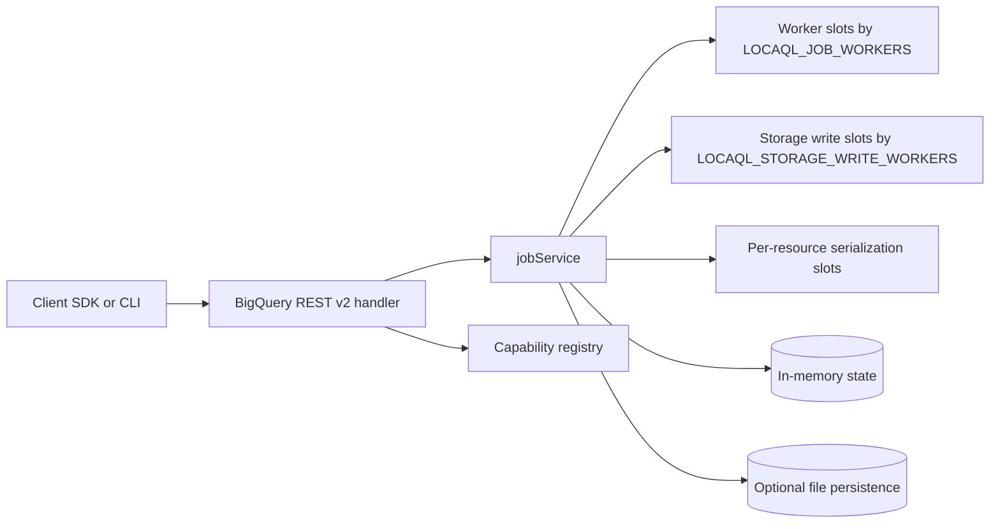
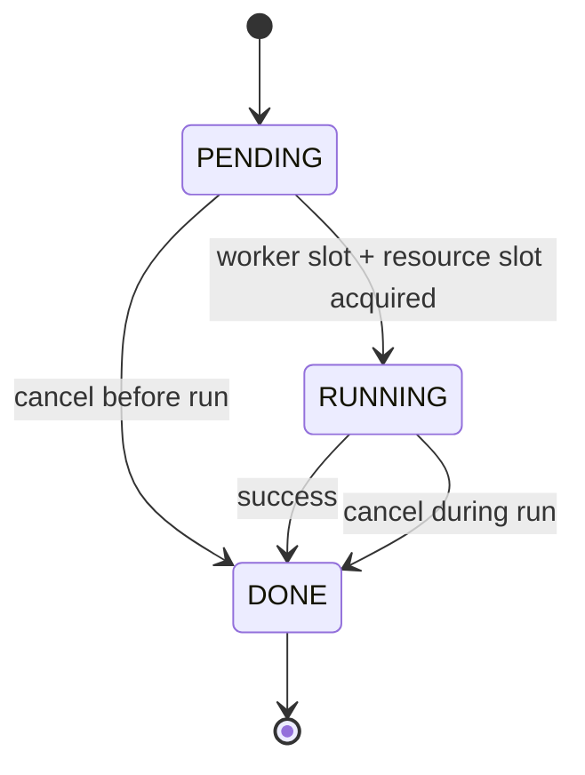
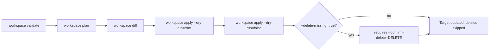
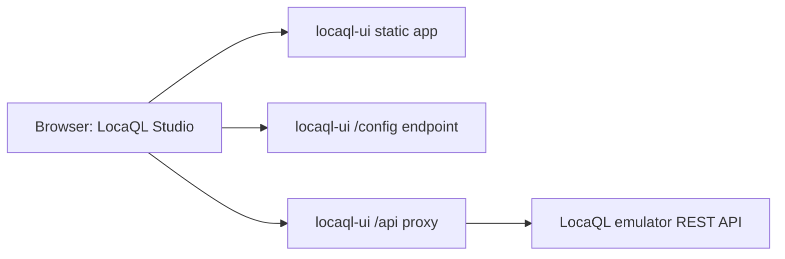

# LocaQL

LocaQL is a local BigQuery-compatible development platform.

This repository currently implements incremental scope from the master plan:
- Foundation emulator endpoints and capability registry.
- REST pagination baseline for datasets, tables, jobs, and tabledata.
- Async jobs engine with cancel, polling, idempotency (TTL), and script parent/child jobs.
- Simulated query/load/extract/copy executors with synthetic statistics.
- Configurable worker limits and resource-level serialization for conflicting job mutations.

## Table of Contents

- [Requirements](#requirements)
- [Quick Start (WSL)](#quick-start-wsl)
- [Capability Registry](#capability-registry)
- [Current Scope Matrix](#current-scope-matrix)
- [Runtime Architecture](#runtime-architecture)
- [Concurrency and Isolation Notes](#concurrency-and-isolation-notes)
- [Job State Model](#job-state-model)
- [Workspace Promotion Flow](#workspace-promotion-flow)
- [Load Jobs: Real Row Ingestion (NDJSON / CSV / Avro / Parquet)](#load-jobs-real-row-ingestion-ndjson--csv--avro--parquet)
- [Extract Jobs: Real Table Export (NDJSON / CSV / Avro / Parquet)](#extract-jobs-real-table-export-ndjson--csv--avro--parquet)
- [Dataset Lifecycle: Delete Contents and Undelete](#dataset-lifecycle-delete-contents-and-undelete)
- [Routines and Models: Metadata CRUD](#routines-and-models-metadata-crud)
- [Conformance Baseline](#conformance-baseline)
- [Test](#test)
- [LocaQL Console (Standalone UI)](#locaql-console-standalone-ui)
- [Contributing](#contributing)
- [License](#license)

## Requirements

- WSL distribution: `Ubuntu-24.04`
- Go 1.24.9+ (bumped from 1.22 to bring in `parquet-go/parquet-go` for real Parquet load/extract support; `GOTOOLCHAIN=auto`, the Go default, downloads it automatically)
- For race tests: `build-essential` (provides `gcc` for cgo).

## Quick Start (WSL)

```bash
wsl -d Ubuntu-24.04 -- bash -lc 'cd /mnt/f/GitHub/LocaQL && go run ./cmd/locaql start --addr :9050'
```

Health check:

```bash
curl http://localhost:9050/_emulator/health
```

Readiness check:

```bash
curl http://localhost:9050/_emulator/readiness
```

## Capability Registry

List loaded capabilities:

```bash
wsl -d Ubuntu-24.04 -- bash -lc 'cd /mnt/f/GitHub/LocaQL && go run ./cmd/locaql capabilities'
```

Registry file:

- `capabilities/registry.yaml`

## Current Scope Matrix

| Area | Status | Notes |
| --- | --- | --- |
| Emulator internal endpoints | Supported | `/_emulator/health`, `/_emulator/readiness`, `/_emulator/version`, `/_emulator/capabilities` |
| Dataset management | Partial | `datasets.list`, `datasets.get`, `datasets.insert`, `datasets.delete` (requires `deleteContents=true` to remove a non-empty dataset's tables), `datasets.patch` (`friendlyName`, `location`, `labels`, `defaultTableExpirationMs` — stored/returned but not yet enforced) |
| REST pagination baseline | Supported | `datasets.list`, `tables.list`, `jobs.list`, `tabledata.list` |
| Opaque pagination tokens | Supported | `nextPageToken` is opaque; legacy numeric token input remains accepted |
| Jobs lifecycle | Supported | `PENDING -> RUNNING -> DONE`, cancel before/during run |
| requestId idempotency | Partial | Implemented for `jobs.insert` and `projects.queries` with TTL |
| Job executors (query/load/extract/copy) | Partial | Query jobs report real `outputRows`/`processedBytes` from the resolved result (`totalSlotMs` stays synthetic by design); copy jobs create real destination table data; load jobs materialize destination schema and ingest real rows from `sourceUris` (`NEWLINE_DELIMITED_JSON`, `CSV`, `AVRO` or `PARQUET`); extract jobs read a real source table and write `destinationUris` in the same four formats, single-shard wildcards resolved. `sourceUris`/`destinationUris` are local paths by default; `gs://` resolves onto a local directory only when `LOCAQL_FAKE_GCS_ROOT` is set (multi-wildcard shards and `ORC` are rejected explicitly) |
| Routines and Models | Supported | `routines`/`models` `insert`/`get`/`list`/`patch`/`delete` are metadata-only (no SQL execution or ML training/inference backend exists; nothing is fabricated beyond stored fields) |
| Job persistence across restart | Partial | Optional local file persistence |
| Job concurrency limit | Partial | Controlled with `LOCAQL_JOB_WORKERS` |
| Storage Write backpressure | Partial | `load/copy` jobs throttled by `LOCAQL_STORAGE_WRITE_WORKERS` |
| Concurrent reads safety | Partial | `jobs.get` and `jobs.list` use read locks (`RWMutex`) |
| Resource mutation serialization | Partial | Conflicting mutations serialized by `project:dataset.table` |
| Catalog snapshot atomicity | Partial | Optional persisted state uses temp file replace to avoid partial commits |
| INFORMATION_SCHEMA priority | Partial | `SCHEMATA`, `SCHEMATA_OPTIONS`, `TABLES`, `COLUMNS`, `TABLE_OPTIONS`, `JOBS`, `JOBS_BY_PROJECT`, `JOBS_BY_USER`, `PARTITIONS`, `ROUTINES` and `MODELS` are served from the in-memory catalog; `VIEWS` returns an empty but structurally correct result (views are not a real resource yet) |
| Workspace validation | Supported | `locaql workspace validate` checks required portable workspace structure before promotion |
| Workspace planning and diff | Supported | `locaql workspace plan` and `locaql workspace diff` provide portable inventory and deterministic source-target delta |
| Workspace apply dry-run | Supported | `locaql workspace apply --dry-run=true` returns planned actions without mutating target |
| Workspace apply mutate | Supported | `locaql workspace apply --dry-run=false` applies planned changes; deletes require explicit `--delete-missing=true --confirm-delete=DELETE` |
| IAM and policies | Unsupported | Deliberately out of scope for local emulator parity; treated as cloud control-plane concerns |
| Standalone UI service | Partial | `cmd/locaql-ui` with dynamic capability-driven console and API proxy |
| UI resource forms | Partial | Explorer can create, update and delete datasets, create tables, and edit basic table metadata against emulator REST endpoints |

## Runtime Architecture



## Concurrency and Isolation Notes

- `jobs.get` and `jobs.list` use read locks while mutating paths use exclusive locks.
- Conflicting table mutations are serialized by resource key (`project:dataset.table`).
- `load/copy` jobs can be throttled independently from generic job workers through `LOCAQL_STORAGE_WRITE_WORKERS`.
- When persistence is enabled, metadata and request-id index are written in one snapshot file commit.
- Snapshot commit uses a temp file and replace strategy so failed writes do not leave partial catalog content.

## Job State Model



## Workspace Promotion Flow

The `locaql workspace` subcommands move a portable workspace from validation to a promoted target without mutating anything until `apply` runs explicitly.



## Load Jobs: Real Row Ingestion (NDJSON / CSV / Avro / Parquet)

`load` jobs materialize the destination table schema unconditionally. When `configuration.load.sourceUris` is set, the emulator also reads and ingests real rows from source files, dispatching on `sourceFormat`:

- `NEWLINE_DELIMITED_JSON`: one JSON object per line, projected onto `schema.fields` by **name**.
- `CSV`: rows mapped onto `schema.fields` by **position**; optional `fieldDelimiter` (default `,`) and `skipLeadingRows` (default `0`) are supported. Row width must match the schema field count exactly — jagged rows fail the job rather than being padded or truncated.
- `AVRO`: records read from an Avro Object Container File and projected onto `schema.fields` by **name**, same as NDJSON. The emulator does not autodetect a BigQuery schema from the file's embedded Avro schema — `schema.fields` is still required.
- `PARQUET`: rows read via [`parquet-go/parquet-go`](https://github.com/parquet-go/parquet-go) using a Parquet schema built from `schema.fields`, projected by **name** just like Avro/NDJSON. Same no-schema-autodetect limitation applies.

`sourceUris` resolve to local file paths by default (optionally prefixed with `file://`). Setting `LOCAQL_FAKE_GCS_ROOT=/some/dir` before starting the emulator makes `gs://bucket/object` URIs resolve onto `/some/dir/bucket/object` instead — a local-disk convenience mapping, **not** a GCS-compatible API. Without that env var, `gs://` is rejected explicitly.

Known limitations, declared explicitly rather than silently ignored:

- Only `NEWLINE_DELIMITED_JSON`, `CSV`, `AVRO` and `PARQUET` are supported; other formats (`ORC`, the BigQuery default when `sourceFormat` is omitted) fail the job explicitly.
- `schema.fields` is required when `sourceUris` is set; there is no schema autodetect yet.
- No `maxBadRecords`/per-row error tolerance yet: any malformed row fails the whole job.
- Avro and Parquet fields are encoded as non-nullable scalars: this codebase has no NULLABLE/REQUIRED mode tracking for any format yet.

```bash
curl -X POST http://localhost:9050/bigquery/v2/projects/p1/jobs \
  -H 'Content-Type: application/json' \
  -d '{
    "configuration": {
      "load": {
        "destinationTable": {"projectId": "p1", "datasetId": "analytics", "tableId": "events"},
        "schema": {"fields": [{"name": "event_id", "type": "INT64"}, {"name": "event_name", "type": "STRING"}]},
        "sourceUris": ["/absolute/path/to/events.ndjson"],
        "sourceFormat": "NEWLINE_DELIMITED_JSON",
        "writeDisposition": "WRITE_TRUNCATE"
      }
    }
  }'
```

## Extract Jobs: Real Table Export (NDJSON / CSV / Avro / Parquet)

`extract` jobs read a real source table from the local catalog (`configuration.extract.sourceTable`) and write it to `destinationUris`, dispatching on `destinationFormat` (default `CSV` when omitted, matching the BigQuery default):

- `CSV`: `fieldDelimiter` (default `,`) and `printHeader` (default `true`, writing `schema.fields` names as the first row).
- `NEWLINE_DELIMITED_JSON`: one JSON object per row, keyed by `schema.fields` names, with `INT64`/`FLOAT64`/`BOOL` cells encoded as native JSON types rather than strings.
- `AVRO`: an Avro Object Container File with a record schema derived from `schema.fields` (`INT64`→`long`, `FLOAT64`→`double`, `BOOL`→`boolean`, else `string`).
- `PARQUET`: a Parquet file written via `parquet-go/parquet-go` using the same type mapping as Avro (`INT64`, `FLOAT64`, `BOOL`, else string).

A single `*` wildcard in `destinationUris` resolves to the BigQuery single-shard convention (`part-*.csv` -> `part-000000000000.csv`); every row still lands in that one file since there is no size-based multi-shard writer yet. The same `LOCAQL_FAKE_GCS_ROOT` mapping described above for load jobs applies to `destinationUris` too.

Known limitations, declared explicitly rather than silently ignored:

- Only `CSV`, `NEWLINE_DELIMITED_JSON`, `AVRO` and `PARQUET` are supported as `destinationFormat`.
- `destinationUris` must be local paths, or `gs://` when `LOCAQL_FAKE_GCS_ROOT` is set; otherwise `gs://` is rejected explicitly.
- `destinationUris` with more than one `*` are rejected explicitly (only a single wildcard, resolved to one shard, is supported).

```bash
curl -X POST http://localhost:9050/bigquery/v2/projects/p1/jobs \
  -H 'Content-Type: application/json' \
  -d '{
    "configuration": {
      "extract": {
        "sourceTable": {"projectId": "p1", "datasetId": "analytics", "tableId": "events"},
        "destinationUris": ["/absolute/path/to/events_export.csv"],
        "destinationFormat": "CSV"
      }
    }
  }'
```

## Dataset Lifecycle: Delete Contents and Undelete

`datasets.delete` requires `deleteContents=true` to remove a dataset that still has tables (matching the real BigQuery contract); without it, the request fails with a 400 naming how many tables are in the way. When `deleteContents=true` is passed, the tables tracked for that dataset are removed along with the dataset itself.

```bash
curl -X DELETE "http://localhost:9050/bigquery/v2/projects/p1/datasets/warehouse?deleteContents=true"
```

`POST /_emulator/datasets/undelete` is a **LocaQL-only convenience endpoint**, deliberately kept outside the `/bigquery/v2/` namespace: BigQuery's REST API has no public dataset-undelete contract, so this is not something a real BigQuery client would ever call. It restores a dataset's metadata (`friendlyName`, `location`, `labels`, `defaultTableExpirationMs`) from the tombstone left by the most recent delete. It never restores table contents, and it fails if a dataset with the same ID already exists or if no tombstone is found.

```bash
curl -X POST http://localhost:9070/_emulator/datasets/undelete \
  -H 'Content-Type: application/json' \
  -d '{"projectId": "p1", "datasetId": "warehouse"}'
```

## Routines and Models: Metadata CRUD

`routines` and `models` support `insert`/`get`/`list`/`patch`/`delete` under `bigquery/v2/projects/{p}/datasets/{d}/routines` and `.../models`. Both are **metadata-only**: there is no SQL execution engine behind routines and no ML training/inference backend behind models, so `definitionBody`/`routineType`/`language` and `modelType`/`friendlyName`/`description`/`labels` round-trip without ever being executed, trained, or scored. `trainingRuns` and evaluation metrics are never fabricated for models.

```bash
curl -X POST http://localhost:9050/bigquery/v2/projects/p1/datasets/analytics/routines \
  -H 'Content-Type: application/json' \
  -d '{
    "routineReference": {"routineId": "add_one"},
    "routineType": "SCALAR_FUNCTION",
    "language": "SQL",
    "definitionBody": "x + 1"
  }'
```

## Conformance Baseline

Run the foundation conformance suite and generate reports:

```bash
wsl -d Ubuntu-24.04 -- bash -lc 'cd /mnt/f/GitHub/LocaQL && go run ./cmd/locaql conformance --base-url http://localhost:9050'
```

Reports:

- `test/conformance/reports/foundation-report.json`
- `test/conformance/reports/foundation-report.md`

Run pagination conformance suite:

```bash
wsl -d Ubuntu-24.04 -- bash -lc 'cd /mnt/f/GitHub/LocaQL && go run ./cmd/locaql conformance --base-url http://localhost:9050 --cases test/conformance/cases/pagination.yaml --report-json test/conformance/reports/pagination-report.json --report-md test/conformance/reports/pagination-report.md'
```

## Test

```bash
wsl -d Ubuntu-24.04 -- bash -lc 'cd /mnt/f/GitHub/LocaQL && go test ./...'
```

Validate consumer workspace layout (Delivery E baseline):

```bash
wsl -d Ubuntu-24.04 -- bash -lc 'cd /mnt/f/GitHub/LocaQL && go run ./cmd/locaql workspace validate --path .'
```

Build workspace plan and diff:

```bash
wsl -d Ubuntu-24.04 -- bash -lc 'cd /mnt/f/GitHub/LocaQL && go run ./cmd/locaql workspace plan --path .'
wsl -d Ubuntu-24.04 -- bash -lc 'cd /mnt/f/GitHub/LocaQL && go run ./cmd/locaql workspace diff --source . --target /tmp/target-workspace'
```

Preview apply actions only (no target mutations):

```bash
wsl -d Ubuntu-24.04 -- bash -lc 'cd /mnt/f/GitHub/LocaQL && go run ./cmd/locaql workspace apply --source . --target /tmp/target-workspace --dry-run=true'
```

Apply planned changes (mutating target):

```bash
wsl -d Ubuntu-24.04 -- bash -lc 'cd /mnt/f/GitHub/LocaQL && go run ./cmd/locaql workspace apply --source . --target /tmp/target-workspace --dry-run=false --manifest-out /tmp/apply-manifest.json'
```

Allow delete operations explicitly (guarded):

```bash
wsl -d Ubuntu-24.04 -- bash -lc 'cd /mnt/f/GitHub/LocaQL && go run ./cmd/locaql workspace apply --source . --target /tmp/target-workspace --dry-run=false --delete-missing=true --confirm-delete=DELETE'
```

Race validation for server concurrency:

```bash
wsl -d Ubuntu-24.04 -- bash -lc 'cd /mnt/f/GitHub/LocaQL && CGO_ENABLED=1 go test -race ./internal/server'
```

## LocaQL Console (Standalone UI)

Run the emulator first:

```bash
wsl -d Ubuntu-24.04 -- bash -lc 'cd /mnt/f/GitHub/LocaQL && go run ./cmd/locaql start --addr :9050'
```

Run the UI service on a separate port:

```bash
wsl -d Ubuntu-24.04 -- bash -lc 'cd /mnt/f/GitHub/LocaQL && go run ./cmd/locaql-ui --addr :9070 --emulator http://localhost:9050'
```

Open:

- `http://localhost:9070`

### Console Architecture

The browser only ever talks to `locaql-ui`; the emulator is reached exclusively through the `/api` proxy, so the browser never opens a direct connection to `:9050`.



UI notes:

- The UI is a separate service and does not access emulator internals directly.
- The UI integrates dynamically through `/_emulator/capabilities` and REST APIs.
- The UI backend proxies `/api/*` to the emulator to avoid browser CORS issues.
- Default UI port: `9070`.

Current UI scope:

- Studio-style layout with navigation, a resource Explorer, and a tabbed workspace (Query, Jobs, Capabilities).
- Explorer with a hierarchical Project > Dataset > Table tree, local resource search, and capability-status badges (`SUPPORTED`, `PARTIAL`, `UNSUPPORTED`, `CONTEXT`) with a persisted filter and legend.
- Explicit `Routines` and `Models` placeholders in the Explorer tree; the emulator backend now supports metadata CRUD for both (see [Routines and Models: Metadata CRUD](#routines-and-models-metadata-crud)), but the Explorer UI has not been wired to those endpoints yet — it still renders them as unsupported-category placeholders.
- Dataset create/update/delete with labels editing, plus a selected-dataset summary panel (ID, friendly name, location, table count, labels) and quick actions to draft a dataset query, draft a table listing query, or copy the dataset ID.
- Table creation and metadata patch (`friendlyName`, `description`, labels), with a table details panel offering Schema, Preview, and JSON tabs plus query, copy-job, and delete actions.
- SQL editor with keyboard shortcuts (`Ctrl+Enter` to run, `Ctrl`/`Cmd+S` to save) and query submission as async jobs.
- Query results panel with Table, JSON, and Execution Details tabs.
- Jobs Explorer with personal/project history tabs, selection, detail refresh, and cancellation.
- Saved Queries stored in the browser (`localStorage`) with local version history, JSON import/export, and shareable URL links.
- Persistent Dark/Light theme toggle.

## Contributing

Issues and pull requests are welcome. See [`CONTRIBUTING.md`](CONTRIBUTING.md) for the branching model (`feature`/`fix`/`docs`/`chore`/`hotfix` → `dev` → `main`), commit conventions, the pull request checklist, and exactly who can approve and merge into `main`/`dev` (branch protection is enforced via a GitHub ruleset + [`CODEOWNERS`](.github/CODEOWNERS): any PR needs the code owner's approval, and only the repository owner can bypass that requirement).

## License

LocaQL is licensed under the [Apache License, Version 2.0](LICENSE). Read [`NOTICE`](NOTICE) before using, deploying, modifying, or forking this project: it explains the attribution you must carry forward into any derivative work, and clarifies that LocaQL is not affiliated with Google or BigQuery.
