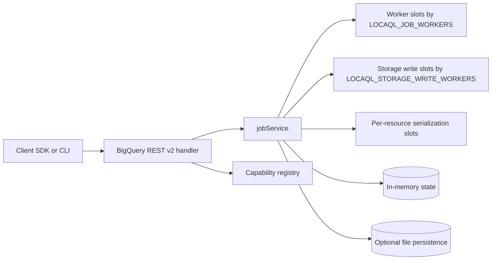
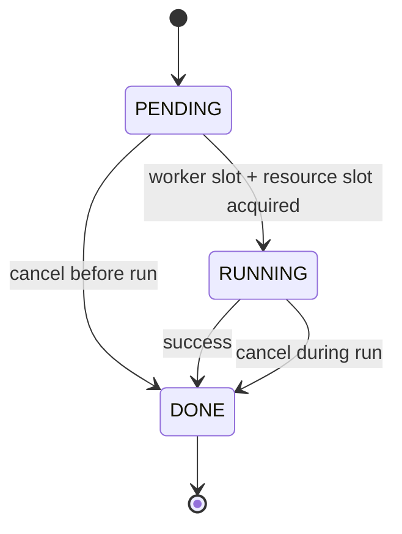
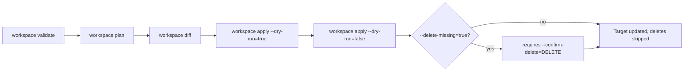
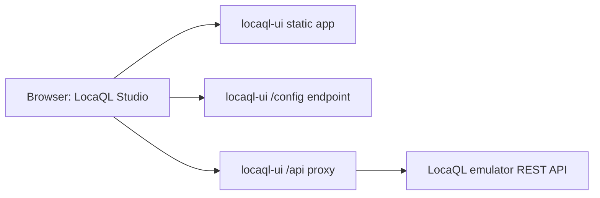

# LocaQL

LocaQL is a local BigQuery-compatible development platform.

This repository currently implements incremental scope from the master plan:
- Foundation emulator endpoints and capability registry.
- REST pagination baseline for datasets, tables, jobs, and tabledata.
- Async jobs engine with cancel, polling, idempotency (TTL), and script parent/child jobs.
- Simulated query/load/extract/copy executors with synthetic statistics.
- Configurable worker limits and resource-level serialization for conflicting job mutations.

## Table of Contents

- [Requirements](#requirements)
- [Quick Start (WSL)](#quick-start-wsl)
- [Capability Registry](#capability-registry)
- [Current Scope Matrix](#current-scope-matrix)
- [Runtime Architecture](#runtime-architecture)
- [Concurrency and Isolation Notes](#concurrency-and-isolation-notes)
- [Job State Model](#job-state-model)
- [Workspace Promotion Flow](#workspace-promotion-flow)
- [Conformance Baseline](#conformance-baseline)
- [Test](#test)
- [LocaQL Console (Standalone UI)](#locaql-console-standalone-ui)

## Requirements

- WSL distribution: `Ubuntu-24.04`
- Go 1.22+
- For race tests: `build-essential` (provides `gcc` for cgo).

## Quick Start (WSL)

```bash
wsl -d Ubuntu-24.04 -- bash -lc 'cd /mnt/f/GitHub/LocaQL && go run ./cmd/locaql start --addr :9050'
```

Health check:

```bash
curl http://localhost:9050/_emulator/health
```

Readiness check:

```bash
curl http://localhost:9050/_emulator/readiness
```

## Capability Registry

List loaded capabilities:

```bash
wsl -d Ubuntu-24.04 -- bash -lc 'cd /mnt/f/GitHub/LocaQL && go run ./cmd/locaql capabilities'
```

Registry file:

- `capabilities/registry.yaml`

## Current Scope Matrix

| Area | Status | Notes |
| --- | --- | --- |
| Emulator internal endpoints | Supported | `/_emulator/health`, `/_emulator/readiness`, `/_emulator/version`, `/_emulator/capabilities` |
| Dataset management | Partial | `datasets.list`, `datasets.get`, `datasets.insert`, `datasets.delete` |
| REST pagination baseline | Supported | `datasets.list`, `tables.list`, `jobs.list`, `tabledata.list` |
| Opaque pagination tokens | Supported | `nextPageToken` is opaque; legacy numeric token input remains accepted |
| Jobs lifecycle | Supported | `PENDING -> RUNNING -> DONE`, cancel before/during run |
| requestId idempotency | Partial | Implemented for `jobs.insert` and `projects.queries` with TTL |
| Job executors (query/load/extract/copy) | Partial | Query/extract remain simulated; copy jobs create real destination table data and load jobs materialize destination table schema in the local catalog |
| Job persistence across restart | Partial | Optional local file persistence |
| Job concurrency limit | Partial | Controlled with `LOCAQL_JOB_WORKERS` |
| Storage Write backpressure | Partial | `load/copy` jobs throttled by `LOCAQL_STORAGE_WRITE_WORKERS` |
| Concurrent reads safety | Partial | `jobs.get` and `jobs.list` use read locks (`RWMutex`) |
| Resource mutation serialization | Partial | Conflicting mutations serialized by `project:dataset.table` |
| Catalog snapshot atomicity | Partial | Optional persisted state uses temp file replace to avoid partial commits |
| INFORMATION_SCHEMA priority | Partial | Basic `SCHEMATA`, `SCHEMATA_OPTIONS`, `TABLES`, `COLUMNS`, `JOBS`, `PARTITIONS`, `ROUTINES` and `MODELS` queries are served from the in-memory catalog |
| Workspace validation | Supported | `locaql workspace validate` checks required portable workspace structure before promotion |
| Workspace planning and diff | Supported | `locaql workspace plan` and `locaql workspace diff` provide portable inventory and deterministic source-target delta |
| Workspace apply dry-run | Supported | `locaql workspace apply --dry-run=true` returns planned actions without mutating target |
| Workspace apply mutate | Supported | `locaql workspace apply --dry-run=false` applies planned changes; deletes require explicit `--delete-missing=true --confirm-delete=DELETE` |
| IAM and policies | Unsupported | Deliberately out of scope for local emulator parity; treated as cloud control-plane concerns |
| Standalone UI service | Partial | `cmd/locaql-ui` with dynamic capability-driven console and API proxy |
| UI resource forms | Partial | Explorer can create, update and delete datasets, create tables, and edit basic table metadata against emulator REST endpoints |

## Runtime Architecture



## Concurrency and Isolation Notes

- `jobs.get` and `jobs.list` use read locks while mutating paths use exclusive locks.
- Conflicting table mutations are serialized by resource key (`project:dataset.table`).
- `load/copy` jobs can be throttled independently from generic job workers through `LOCAQL_STORAGE_WRITE_WORKERS`.
- When persistence is enabled, metadata and request-id index are written in one snapshot file commit.
- Snapshot commit uses a temp file and replace strategy so failed writes do not leave partial catalog content.

## Job State Model



## Workspace Promotion Flow

The `locaql workspace` subcommands move a portable workspace from validation to a promoted target without mutating anything until `apply` runs explicitly.



## Conformance Baseline

Run the foundation conformance suite and generate reports:

```bash
wsl -d Ubuntu-24.04 -- bash -lc 'cd /mnt/f/GitHub/LocaQL && go run ./cmd/locaql conformance --base-url http://localhost:9050'
```

Reports:

- `test/conformance/reports/foundation-report.json`
- `test/conformance/reports/foundation-report.md`

Run pagination conformance suite:

```bash
wsl -d Ubuntu-24.04 -- bash -lc 'cd /mnt/f/GitHub/LocaQL && go run ./cmd/locaql conformance --base-url http://localhost:9050 --cases test/conformance/cases/pagination.yaml --report-json test/conformance/reports/pagination-report.json --report-md test/conformance/reports/pagination-report.md'
```

## Test

```bash
wsl -d Ubuntu-24.04 -- bash -lc 'cd /mnt/f/GitHub/LocaQL && go test ./...'
```

Validate consumer workspace layout (Delivery E baseline):

```bash
wsl -d Ubuntu-24.04 -- bash -lc 'cd /mnt/f/GitHub/LocaQL && go run ./cmd/locaql workspace validate --path .'
```

Build workspace plan and diff:

```bash
wsl -d Ubuntu-24.04 -- bash -lc 'cd /mnt/f/GitHub/LocaQL && go run ./cmd/locaql workspace plan --path .'
wsl -d Ubuntu-24.04 -- bash -lc 'cd /mnt/f/GitHub/LocaQL && go run ./cmd/locaql workspace diff --source . --target /tmp/target-workspace'
```

Preview apply actions only (no target mutations):

```bash
wsl -d Ubuntu-24.04 -- bash -lc 'cd /mnt/f/GitHub/LocaQL && go run ./cmd/locaql workspace apply --source . --target /tmp/target-workspace --dry-run=true'
```

Apply planned changes (mutating target):

```bash
wsl -d Ubuntu-24.04 -- bash -lc 'cd /mnt/f/GitHub/LocaQL && go run ./cmd/locaql workspace apply --source . --target /tmp/target-workspace --dry-run=false --manifest-out /tmp/apply-manifest.json'
```

Allow delete operations explicitly (guarded):

```bash
wsl -d Ubuntu-24.04 -- bash -lc 'cd /mnt/f/GitHub/LocaQL && go run ./cmd/locaql workspace apply --source . --target /tmp/target-workspace --dry-run=false --delete-missing=true --confirm-delete=DELETE'
```

Race validation for server concurrency:

```bash
wsl -d Ubuntu-24.04 -- bash -lc 'cd /mnt/f/GitHub/LocaQL && CGO_ENABLED=1 go test -race ./internal/server'
```

## LocaQL Console (Standalone UI)

Run the emulator first:

```bash
wsl -d Ubuntu-24.04 -- bash -lc 'cd /mnt/f/GitHub/LocaQL && go run ./cmd/locaql start --addr :9050'
```

Run the UI service on a separate port:

```bash
wsl -d Ubuntu-24.04 -- bash -lc 'cd /mnt/f/GitHub/LocaQL && go run ./cmd/locaql-ui --addr :9070 --emulator http://localhost:9050'
```

Open:

- `http://localhost:9070`

### Console Architecture

The browser only ever talks to `locaql-ui`; the emulator is reached exclusively through the `/api` proxy, so the browser never opens a direct connection to `:9050`.



UI notes:

- The UI is a separate service and does not access emulator internals directly.
- The UI integrates dynamically through `/_emulator/capabilities` and REST APIs.
- The UI backend proxies `/api/*` to the emulator to avoid browser CORS issues.
- Default UI port: `9070`.

Current UI scope:

- Studio-style layout with navigation, a resource Explorer, and a tabbed workspace (Query, Jobs, Capabilities).
- Explorer with a hierarchical Project > Dataset > Table tree, local resource search, and capability-status badges (`SUPPORTED`, `PARTIAL`, `UNSUPPORTED`, `CONTEXT`) with a persisted filter and legend.
- Explicit `Routines` and `Models` placeholders in the Explorer to expose catalog categories that are not backed by the emulator yet.
- Dataset create/update/delete with labels editing, plus a selected-dataset summary panel (ID, friendly name, location, table count, labels) and quick actions to draft a dataset query, draft a table listing query, or copy the dataset ID.
- Table creation and metadata patch (`friendlyName`, `description`, labels), with a table details panel offering Schema, Preview, and JSON tabs plus query, copy-job, and delete actions.
- SQL editor with keyboard shortcuts (`Ctrl+Enter` to run, `Ctrl`/`Cmd+S` to save) and query submission as async jobs.
- Query results panel with Table, JSON, and Execution Details tabs.
- Jobs Explorer with personal/project history tabs, selection, detail refresh, and cancellation.
- Saved Queries stored in the browser (`localStorage`) with local version history, JSON import/export, and shareable URL links.
- Persistent Dark/Light theme toggle.
