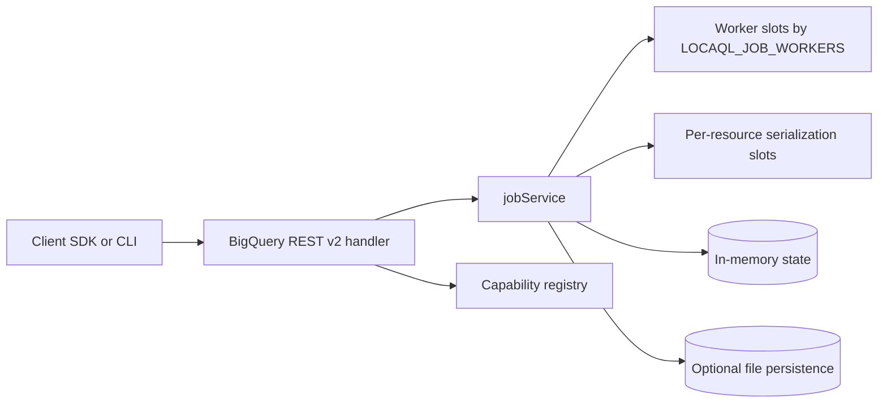
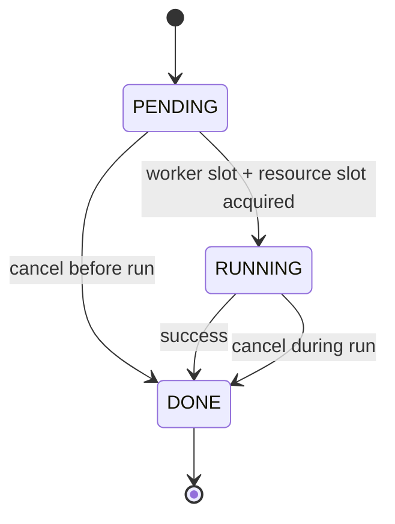

# LocaQL

LocaQL is a local BigQuery-compatible development platform.

This repository currently implements incremental scope from the master plan:
- Foundation emulator endpoints and capability registry.
- REST pagination baseline for datasets, tables, jobs, and tabledata.
- Async jobs engine with cancel, polling, idempotency (TTL), and script parent/child jobs.
- Simulated query/load/extract/copy executors with synthetic statistics.
- Configurable worker limits and resource-level serialization for conflicting job mutations.

## Requirements

- WSL distribution: `Ubuntu-24.04`
- Go 1.22+
- For race tests: `build-essential` (provides `gcc` for cgo).

## Quick Start (WSL)

```bash
wsl -d Ubuntu-24.04 -- bash -lc 'cd /mnt/f/GitHub/LocaQL && go run ./cmd/locaql start --addr :9050'
```

Health check:

```bash
curl http://localhost:9050/_emulator/health
```

## Capability Registry

List loaded capabilities:

```bash
wsl -d Ubuntu-24.04 -- bash -lc 'cd /mnt/f/GitHub/LocaQL && go run ./cmd/locaql capabilities'
```

Registry file:

- `capabilities/registry.yaml`

## Current Scope Matrix

| Area | Status | Notes |
| --- | --- | --- |
| Emulator internal endpoints | Supported | `/_emulator/health`, `/_emulator/version`, `/_emulator/capabilities` |
| REST pagination baseline | Supported | `datasets.list`, `tables.list`, `jobs.list`, `tabledata.list` |
| Jobs lifecycle | Supported | `PENDING -> RUNNING -> DONE`, cancel before/during run |
| requestId idempotency | Partial | Implemented for `jobs.insert` subset with TTL |
| Job executors (query/load/extract/copy) | Partial | Simulated execution and synthetic stats |
| Job persistence across restart | Partial | Optional local file persistence |
| Job concurrency limit | Partial | Controlled with `LOCAQL_JOB_WORKERS` |
| Concurrent reads safety | Partial | `jobs.get` and `jobs.list` use read locks (`RWMutex`) |
| Resource mutation serialization | Partial | Conflicting mutations serialized by `project:dataset.table` |

## Runtime Architecture



## Job State Model



## Conformance Baseline

Run the foundation conformance suite and generate reports:

```bash
wsl -d Ubuntu-24.04 -- bash -lc 'cd /mnt/f/GitHub/LocaQL && go run ./cmd/locaql conformance --base-url http://localhost:9050'
```

Reports:

- `test/conformance/reports/foundation-report.json`
- `test/conformance/reports/foundation-report.md`

Run pagination conformance suite:

```bash
wsl -d Ubuntu-24.04 -- bash -lc 'cd /mnt/f/GitHub/LocaQL && go run ./cmd/locaql conformance --base-url http://localhost:9050 --cases test/conformance/cases/pagination.yaml --report-json test/conformance/reports/pagination-report.json --report-md test/conformance/reports/pagination-report.md'
```

## Test

```bash
wsl -d Ubuntu-24.04 -- bash -lc 'cd /mnt/f/GitHub/LocaQL && go test ./...'
```

Race validation for server concurrency:

```bash
wsl -d Ubuntu-24.04 -- bash -lc 'cd /mnt/f/GitHub/LocaQL && CGO_ENABLED=1 go test -race ./internal/server'
```
