# LocaQL

[](https://github.com/lraigosov/LocaQL/actions/workflows/ci.yml)

LocaQL is a local BigQuery-compatible development platform.

This repository currently implements incremental scope from the master plan:
- Foundation emulator endpoints and capability registry.
- REST pagination baseline for datasets, tables, jobs, and tabledata.
- Async jobs engine with cancel, polling, idempotency (TTL), and script parent/child jobs.
- Simulated query/load/extract/copy executors with synthetic statistics.
- Configurable worker limits and resource-level serialization for conflicting job mutations.

## Table of Contents

- [Requirements](#requirements)
- [Quick Start (WSL)](#quick-start-wsl)
- [Capability Registry](#capability-registry)
- [Current Scope Matrix](#current-scope-matrix)
- [Known Divergences from Real BigQuery](#known-divergences-from-real-bigquery)
- [Runtime Architecture](#runtime-architecture)
- [Query Engine: Real GoogleSQL via an Embedded SQLite Backend](#query-engine-real-googlesql-via-an-embedded-sqlite-backend)
- [Concurrency and Isolation Notes](#concurrency-and-isolation-notes)
- [Job State Model](#job-state-model)
- [Operational Observability: Structured Logging, Request Metrics, and Extended Health](#operational-observability-structured-logging-request-metrics-and-extended-health)
- [Workspace Promotion Flow](#workspace-promotion-flow)
- [Load Jobs: Real Row Ingestion (NDJSON / CSV / Avro / Parquet)](#load-jobs-real-row-ingestion-ndjson--csv--avro--parquet)
- [Extract Jobs: Real Table Export (NDJSON / CSV / Avro / Parquet)](#extract-jobs-real-table-export-ndjson--csv--avro--parquet)
- [Nested Schemas: STRUCT/RECORD and ARRAY/REPEATED](#nested-schemas-structrecord-and-arrayrepeated)
- [Dataset Lifecycle: Delete Contents and Undelete](#dataset-lifecycle-delete-contents-and-undelete)
- [Table Expiration: defaultTableExpirationMs Enforcement](#table-expiration-defaulttableexpirationms-enforcement)
- [Routines and Models: Metadata CRUD](#routines-and-models-metadata-crud)
- [External Tables: Query Local Files Without Loading](#external-tables-query-local-files-without-loading)
- [Views and Materialized Views: Real Resources Backed by the Query Engine](#views-and-materialized-views-real-resources-backed-by-the-query-engine)
- [Sessions and Multi-Statement Transactions](#sessions-and-multi-statement-transactions)
- [BigQuery Storage API: Real gRPC Read Sessions (Avro) and Write Streams (Protobuf)](#bigquery-storage-api-real-grpc-read-sessions-avro-and-write-streams-protobuf)
- [Fake GCS: A Real Cloud Storage JSON API, Locally](#fake-gcs-a-real-cloud-storage-json-api-locally)
- [Conformance Baseline](#conformance-baseline)
- [Test](#test)
- [End-to-End Console Tests](#end-to-end-console-tests)
- [LocaQL Console (Standalone UI)](#locaql-console-standalone-ui)
- [Building and Releasing](#building-and-releasing)
- [Continuous Integration](#continuous-integration)
- [Contributing](#contributing)
- [License](#license)

## Requirements

- WSL distribution: `Ubuntu-24.04`
- Go 1.25.0+ (bumped from 1.22 for `parquet-go/parquet-go`, then to 1.25.0 for `goccy/googlesqlite`'s real GoogleSQL query engine; `GOTOOLCHAIN=auto`, the Go default, downloads it automatically)
- For race tests: `build-essential` (provides `gcc` for cgo).
- **Run LocaQL itself on Linux (including WSL on Windows) — not verified to work natively on Windows or macOS.** The query engine's WASM-based analyzer traps at runtime outside Linux (discovered in Sesión 85; see [Known Divergences](KNOWN-DIVERGENCES.md) Blocking #3): the binary builds fine for every platform, but every query fails. Building/cross-compiling from any OS is unaffected — only running it natively on Windows/macOS is currently broken.

## Quick Start (WSL)

```bash
wsl -d Ubuntu-24.04 -- bash -lc 'cd /mnt/f/GitHub/LocaQL && go run ./cmd/locaql start --addr :9050'
```

Health check:

```bash
curl http://localhost:9050/_emulator/health
```

Readiness check:

```bash
curl http://localhost:9050/_emulator/readiness
```

## Capability Registry

List loaded capabilities:

```bash
wsl -d Ubuntu-24.04 -- bash -lc 'cd /mnt/f/GitHub/LocaQL && go run ./cmd/locaql capabilities'
```

Registry file:

- `capabilities/registry.yaml`

## Current Scope Matrix

| Area | Status | Notes |
| --- | --- | --- |
| Emulator internal endpoints | Supported | `/_emulator/health`, `/_emulator/readiness` (both now include per-subsystem diagnostics), `/_emulator/version`, `/_emulator/capabilities`, `/_emulator/metrics` |
| Operational observability | Partial | Structured (`log/slog` JSON) request logging, a `/_emulator/metrics` JSON snapshot (request counts/latency histogram, job submitted/completed/failed counters, live queue/backpressure gauges), and a `/_emulator/diagnostics` guided-troubleshooting endpoint (real persistence failure tracking, recent job failures, contended resource lock keys, active sessions, effective `LOCAQL_*` env vars) — see [Operational Observability](#operational-observability-structured-logging-request-metrics-and-extended-health). No Prometheus text exposition, distributed tracing, slow-query log, or catalog audit yet; release pipeline (binary/container/notes) not started |
| Dataset management | Supported | `datasets.list`, `datasets.get`, `datasets.insert`, `datasets.delete` (requires `deleteContents=true` to remove a non-empty dataset's tables), `datasets.patch` (`friendlyName`, `location`, `labels`, `defaultTableExpirationMs` — now enforced: tables lazily expire and are purged based on it, or on an explicit per-table `expirationTime` override) |
| REST pagination baseline | Supported | `datasets.list`, `tables.list`, `jobs.list`, `tabledata.list` |
| Opaque pagination tokens | Supported | `nextPageToken` is opaque; legacy numeric token input remains accepted |
| Jobs lifecycle | Supported | `PENDING -> RUNNING -> DONE`, cancel before/during run |
| requestId idempotency | Partial | Implemented for `jobs.insert` and `projects.queries` with TTL |
| Job executors (query/load/extract/copy) | Partial | Query jobs execute real GoogleSQL — `WHERE`, projection, `JOIN`, aggregation, `ORDER BY`, `LIMIT` — via an embedded engine (see [Query Engine](#query-engine-real-googlesql-via-an-embedded-sqlite-backend)), reporting real `outputRows`/`processedBytes` (`totalSlotMs` stays synthetic by design); copy jobs create real destination table data; load jobs materialize destination schema and ingest real rows from `sourceUris` (`NEWLINE_DELIMITED_JSON`, `CSV`, `AVRO` or `PARQUET`, with optional `GZIP` decompression for CSV/NDJSON); extract jobs read a real source table and write `destinationUris` in the same four formats with optional `compression` (`GZIP` for CSV/NDJSON, `SNAPPY`/`DEFLATE` for Avro, `SNAPPY`/`GZIP` for Parquet), and split into multiple real shard files once `LOCAQL_EXTRACT_SHARD_MAX_BYTES` is set and exceeded (single shard by default). `sourceUris`/`destinationUris` are local paths by default; `gs://` resolves onto a local directory only when `LOCAQL_FAKE_GCS_ROOT` is set (multi-wildcard `destinationUris` and `ORC` are rejected explicitly) |
| Routines and Models | Supported | `routines`/`models` `insert`/`get`/`list`/`patch`/`delete` are metadata-only (no SQL execution or ML training/inference backend exists; nothing is fabricated beyond stored fields) |
| External tables | Partial | `tables.insert` accepts `externalDataConfiguration` (`NEWLINE_DELIMITED_JSON`/`CSV`/`AVRO`/`PARQUET`, explicit schema, no autodetect); `sourceUris` are read fresh from disk/fake-GCS on every query/`tabledata.list`/copy/extract access rather than materialized at creation. Patching `externalDataConfiguration`, autodetect, Hive partitioning and compression options are not supported |
| Views and Materialized Views | Partial | `tables.insert` accepts `view.query`/`materializedView.query`, validated and schema-derived by executing the query through the real query engine at creation; every access re-executes the stored query live (see [Views and Materialized Views](#views-and-materialized-views-real-resources-backed-by-the-query-engine)). No patch-based redefinition; materialized views are not actually cached/refreshed |
| Nested schemas and column evolution | Partial | `schema.fields` supports real `mode` (`NULLABLE`/`REQUIRED`/`REPEATED`) and nested `fields` (`RECORD`/`STRUCT`), rendered end-to-end with BigQuery's real nested REST shape; `tables.patch` can append `NULLABLE` columns and relax `REQUIRED`→`NULLABLE` (see [Nested Schemas](#nested-schemas-structrecord-and-arrayrepeated)). Real nested load/extract is `NEWLINE_DELIMITED_JSON`-only; `CSV`/`AVRO`/`PARQUET` reject nested fields explicitly |
| Fake GCS JSON API | Partial | Buckets (insert/list/get) and objects (insert via media or multipart upload, get/download/list/delete) on the real endpoint paths, backed by `LOCAQL_FAKE_GCS_ROOT`; verified against `cloud.google.com/go/storage`. No resumable uploads, IAM, versioning, lifecycle rules, notifications, or signed URLs |
| Job persistence across restart | Partial | Optional local file persistence |
| Job concurrency limit | Partial | Controlled with `LOCAQL_JOB_WORKERS` |
| Storage Write backpressure | Partial | `load/copy` jobs throttled by `LOCAQL_STORAGE_WRITE_WORKERS` |
| Concurrent reads safety | Partial | `jobs.get` and `jobs.list` use read locks (`RWMutex`) |
| Resource mutation serialization | Partial | Conflicting mutations serialized by `project:dataset.table` |
| Catalog snapshot atomicity | Partial | Optional persisted state uses temp file replace to avoid partial commits |
| INFORMATION_SCHEMA priority | Partial | `SCHEMATA`, `SCHEMATA_OPTIONS`, `TABLES`, `COLUMNS`, `TABLE_OPTIONS`, `JOBS`, `JOBS_BY_PROJECT`, `JOBS_BY_USER`, `PARTITIONS`, `ROUTINES`, `PARAMETERS`, `MODELS`, `VIEWS`, `MATERIALIZED_VIEWS` and `SESSIONS_BY_USER` are served from the in-memory catalog; none support column projection yet (a `SELECT` with an explicit column list still returns every column). `SESSIONS_BY_PROJECT` is not implemented, matching real BigQuery |
| Sessions and transactions | Partial | `createSession`/`connectionProperties` (`session_id`) on `jobs.query`/`jobs.insert`, idle-expiring; session-scoped `` _SESSION.<table> `` temp tables (`CREATE TEMP TABLE ... AS SELECT` only) and `BEGIN`/`COMMIT`/`ROLLBACK TRANSACTION` implemented in LocaQL's own catalog rather than passed through to the query engine (see [Sessions and Multi-Statement Transactions](#sessions-and-multi-statement-transactions)); a transaction's atomicity never extends to real base tables |
| BigQuery Storage API (gRPC) | Partial | Real `CreateReadSession`/`ReadRows` and `CreateWriteStream`/`AppendRows`/`FinalizeWriteStream`/`BatchCommitWriteStreams` on a separate plaintext gRPC listener (`--storage-grpc-addr`, default `:9060`); Read: column projection/`row_restriction` run through the real SQL engine, Avro framing only, one stream per session, no `SplitReadStream`/Arrow. Write: real protobuf row decoding via `dynamicpb`, `_default`/COMMITTED/PENDING streams with atomic `BatchCommitWriteStreams` and real offset/exactly-once semantics, no BUFFERED streams/`FlushRows` (see [BigQuery Storage API](#bigquery-storage-api-real-grpc-read-sessions-avro-and-write-streams-protobuf)) |
| Workspace validation | Supported | `locaql workspace validate` checks required portable workspace structure before promotion |
| Workspace planning and diff | Supported | `locaql workspace plan` and `locaql workspace diff` provide portable inventory and deterministic source-target delta |
| Workspace apply dry-run | Supported | `locaql workspace apply --dry-run=true` returns planned actions without mutating target |
| Workspace apply mutate | Supported | `locaql workspace apply --dry-run=false` applies planned changes; deletes require explicit `--delete-missing=true --confirm-delete=DELETE` |
| Workspace REST + console UI | Supported | The same validate/plan/diff/apply operations are reachable via `/_emulator/workspace/*` REST endpoints and a dedicated console **Workspace** tab (see [Workspace Promotion Flow](#workspace-promotion-flow)) — identical behavior to the CLI, verified end-to-end against a real headless-Chrome console |
| IAM and policies | Unsupported | Deliberately out of scope for local emulator parity; treated as cloud control-plane concerns |
| Standalone UI service | Supported | `cmd/locaql-ui` with dynamic capability-driven console and API proxy |
| UI resource forms | Supported | Explorer can create/update/delete datasets (with `deleteContents` retry and Undelete), create tables (native and external) and edit basic table metadata, and create/select/delete real Routines and Models, all against emulator REST endpoints; a dedicated Load/Extract tab submits real load and extract jobs, and a dedicated Workspace tab drives validate/plan/diff/apply. All `console.ui.*` capabilities are verified by a headless-Chrome e2e suite (see [End-to-End Console Tests](#end-to-end-console-tests)), not just by reading the code |

## Known Divergences from Real BigQuery

The matrix above says *whether* something is supported; it doesn't say how much a gap actually matters for a real workflow. [`KNOWN-DIVERGENCES.md`](KNOWN-DIVERGENCES.md) classifies every partial/unsupported capability (plus a couple of gaps found by reading the code directly, not yet reflected as their own registry entry) by severity — **Blocking** (silently wrong, no workaround), **Significant** (fails explicitly, workaround usually possible), **Minor** (narrow edge case), or **By design** (permanent non-goal). Read it before relying on this emulator for anything beyond the three query shapes and REST flows this README documents as real.

## Runtime Architecture

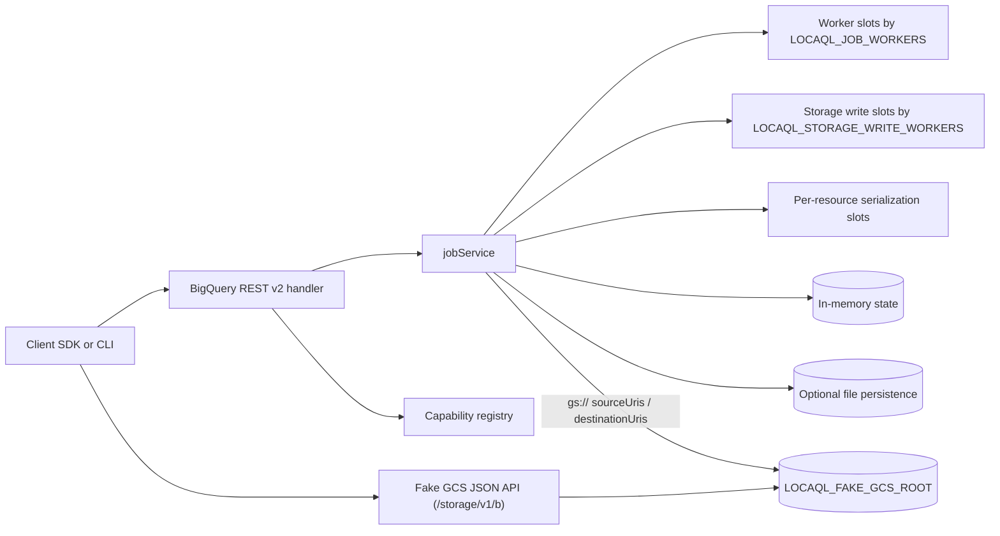
```mermaid
flowchart LR
	Client[Client SDK or CLI] --> REST[BigQuery REST v2 handler]
	Client --> GCSApi["Fake GCS JSON API (/storage/v1/b)"]
	REST --> JobService[jobService]
	REST --> Registry[Capability registry]
	JobService --> WorkerSlots[Worker slots by LOCAQL_JOB_WORKERS]
	JobService --> StorageSlots[Storage write slots by LOCAQL_STORAGE_WRITE_WORKERS]
	JobService --> ResourceSlots[Per-resource serialization slots]
	JobService --> StateStore[(In-memory state)]
	JobService --> Persist[(Optional file persistence)]
	JobService -->|"gs:// sourceUris / destinationUris"| FakeGCSRoot[(LOCAQL_FAKE_GCS_ROOT)]
	GCSApi --> FakeGCSRoot
```

## Query Engine: Real GoogleSQL via an Embedded SQLite Backend

`jobs.insert` (async query jobs), `jobs.query` (sync) and `projects.queries` execute query text against a real GoogleSQL engine: [`github.com/goccy/googlesqlite`](https://github.com/goccy/googlesqlite), a pure-Go `database/sql` driver (no cgo) that parses and analyzes GoogleSQL — the dialect BigQuery and Cloud Spanner use — and executes it against an in-memory SQLite backend. This replaced an earlier regex-based simulator that only matched a handful of query shapes and returned fabricated placeholder rows for anything else (see [`KNOWN-DIVERGENCES.md`](KNOWN-DIVERGENCES.md) for that history).

For every query, LocaQL scans the query text for `FROM`/`JOIN` table references, materializes exactly those tables into a fresh in-memory engine instance (one SQL schema per dataset, real rows converted from LocaQL's stored string-per-cell representation into typed values), then runs the query for real. This means `WHERE`, column projection, `JOIN`, aggregate functions with `GROUP BY`, `ORDER BY` and `LIMIT` are genuine GoogleSQL semantics now, not simulated.

Core scalar types execute with real GoogleSQL semantics too: `NUMERIC`/`BIGNUMERIC` are real decimal types in the engine (exact precision and arithmetic — `0.1 + 0.2` is exactly `0.3`, not `FLOAT64`'s binary rounding error), and `DATE`/`DATETIME`/`TIME`/`TIMESTAMP` round-trip unchanged through `tabledata.list` and compare correctly column-to-column through the engine. Constructing a `DATE` from a string (`DATE 'YYYY-MM-DD'` literal syntax or `CAST(string AS DATE)`) used to be off by one day on a host machine configured with a negative UTC offset — root-caused in Sesión 85 to the process's ambient local timezone, not a fixed engine defect, and fixed by forcing `time.Local = time.UTC` at startup (see [`KNOWN-DIVERGENCES.md`](KNOWN-DIVERGENCES.md) for the full story).

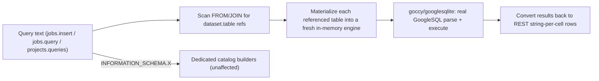
```mermaid
flowchart LR
	Query["Query text (jobs.insert / jobs.query / projects.queries)"] --> Scan["Scan FROM/JOIN for dataset.table refs"]
	Scan --> Materialize["Materialize each referenced table into a fresh in-memory engine"]
	Materialize --> Engine["goccy/googlesqlite: real GoogleSQL parse + execute"]
	Engine --> Convert["Convert results back to REST string-per-cell rows"]
	Query -->|"INFORMATION_SCHEMA.X"| InfoSchema["Dedicated catalog builders (unaffected)"]
```

Known scope, declared explicitly:

- A `project.dataset.table` reference only resolves when the leading component matches the request's own `projectID` (case-insensitive); the engine has no project-level concept, only one SQL schema per dataset. A genuine cross-project reference fails with "table not found" rather than silently resolving against the wrong project.
- Nested `STRUCT`/`ARRAY` result columns execute correctly and get a real BigQuery-shaped `RECORD`/`REPEATED` schema entry and REST cell shape (see [Nested Schemas](#nested-schemas-structrecord-and-arrayrepeated)).
- Only `SELECT` is routed through the real engine. `INSERT`/`UPDATE`/`DELETE`/`CREATE TABLE AS SELECT` issued as a query job's text are not wired to LocaQL's catalog — table mutation still goes exclusively through the existing REST job executors (load/copy/extract) and direct `tables`/`datasets` endpoints.
- `INFORMATION_SCHEMA.X` queries are still handled by LocaQL's own dedicated builders (see the [Current Scope Matrix](#current-scope-matrix)), since those reflect LocaQL's catalog metadata rather than user table data.
- `totalSlotMs` and dry-run byte estimates remain synthetic, as already declared — there is no query-plan/cost estimation.

```bash
curl -X POST http://localhost:9050/bigquery/v2/projects/p1/queries \
  -H 'Content-Type: application/json' \
  -d '{"query": "SELECT region, COUNT(*) AS n, SUM(amount) AS total FROM p1.analytics.orders WHERE amount > 10 GROUP BY region ORDER BY total DESC"}'
```

## Concurrency and Isolation Notes

- `jobs.get` and `jobs.list` use read locks while mutating paths use exclusive locks.
- Conflicting table mutations are serialized by resource key (`project:dataset.table`).
- `load/copy` jobs can be throttled independently from generic job workers through `LOCAQL_STORAGE_WRITE_WORKERS`.
- When persistence is enabled, metadata and request-id index are written in one snapshot file commit.
- Snapshot commit uses a temp file and replace strategy so failed writes do not leave partial catalog content.

## Job State Model

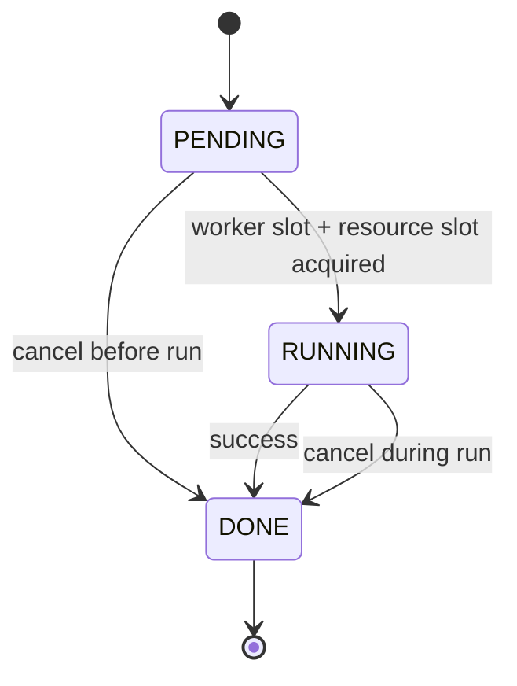
```mermaid
stateDiagram-v2
	[*] --> PENDING
	PENDING --> RUNNING: worker slot + resource slot acquired
	PENDING --> DONE: cancel before run
	RUNNING --> DONE: success
	RUNNING --> DONE: cancel during run
	DONE --> [*]
```

## Operational Observability: Structured Logging, Request Metrics, and Extended Health

Every request passes through a real HTTP middleware (`internal/server/observability.go`) that records metrics and emits a structured (`log/slog`, JSON) log line: successful requests log at `Debug` (silent at the default level, keeping normal test/CLI output quiet), `4xx` at `Warn`, `5xx` at `Error` — problems surface by default, without needing a verbose flag first.

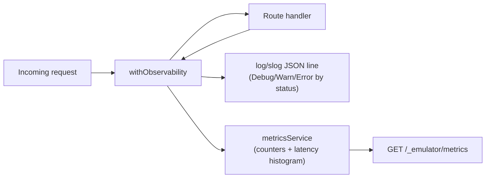
```mermaid
flowchart LR
	Request[Incoming request] --> Middleware[withObservability]
	Middleware --> Handler[Route handler]
	Handler --> Middleware
	Middleware --> Log["log/slog JSON line\n(Debug/Warn/Error by status)"]
	Middleware --> Metrics["metricsService\n(counters + latency histogram)"]
	Metrics --> Endpoint["GET /_emulator/metrics"]
```

`GET /_emulator/metrics` returns a JSON snapshot:

```bash
curl http://localhost:9050/_emulator/metrics
```

```json
{
  "uptimeSeconds": 42.1,
  "requests": {
    "total": 128,
    "byStatusClass": {"1xx": 0, "2xx": 120, "3xx": 0, "4xx": 6, "5xx": 2},
    "byRouteGroup": {"emulator": 20, "bigquery": 100, "storage": 8},
    "latencyMsBuckets": [{"leMs": "5", "count": 80}, {"leMs": "10", "count": 30}, "..."]
  },
  "jobs": {
    "submittedTotal": 40, "completedTotal": 37, "failedTotal": 3,
    "runQueue": {"depth": 0, "capacity": 4, "unbounded": false},
    "storageWriteQueue": {"depth": 0, "capacity": 0, "unbounded": true},
    "resourceLocksHeld": 0, "resourceLocksTotal": 3
  },
  "sessions": {"active": 1}
}
```

`GET /_emulator/health` and `GET /_emulator/readiness` both include the same live `jobs`/`sessions` diagnostic detail under a `subsystems` key, so a health check surfaces real queue/backpressure/session state rather than a flat `{"status":"ok"}`.

Known limitations, declared explicitly:

- The metrics format is plain JSON, not Prometheus text exposition — consistent with the rest of this REST API and no new dependency, but not directly scrapeable by a real Prometheus/Grafana instance without an intermediate exporter.
- No distributed tracing (REST handler → service → SQL engine → SQLite is not span-instrumented), no OpenTelemetry export, no slow-query log, and no sensitive-data log redaction policy — this is the "minimal metrics" increment of the master plan's broader observability vision, not the full wishlist.
- There is no automatic retry mechanism anywhere in this codebase (a failed job is never re-run), so no retry counter is reported — one would always read zero.

### Guided Troubleshooting

`GET /_emulator/diagnostics` answers "why is this broken" rather than `/_emulator/metrics`' raw counters:

```bash
curl http://localhost:9050/_emulator/diagnostics
```

```json
{
  "persistence": {"enabled": true, "path": "/data/locaql-state.json"},
  "recentJobFailures": [{"projectId": "p1", "jobId": "job_7", "jobType": "load", "errorReason": "invalid", "errorMessage": "...", "endedAt": "..."}],
  "resourceLocks": {"held": ["p1:analytics.events"], "total": 3},
  "sessions": {"active": 1},
  "environment": {"LOCAQL_JOB_WORKERS": "4"}
}
```

- **`persistence`** surfaces a real failure that was previously invisible: every `persistLocked()` call site already discarded its returned error, so a full disk or a permissions problem failed silently forever. `lastError`/`lastErrorAt` only appear after a real failure.
- **`recentJobFailures`** lists the actual failed jobs behind a `failedTotal` count (project/job ID/type/reason/message/end time, newest first, capped at 20) — which job failed and why, not just how many.
- **`resourceLocks.held`** names the specific `project:dataset.table` keys currently locked, not just a count — which table is contended, the guided part of diagnosing a mutation that appears to hang.
- **`environment`** lists every `LOCAQL_*` variable that changes behavior, read live (not cached at startup) and included only when actually set — an unset one silently uses its documented default, and showing it as empty would misleadingly suggest it was explicitly configured to nothing.

Known limitations: no dataset/table/routine/model catalog audit (a separate, larger feature); no report of whether the Storage API gRPC listener is reachable (it lives in a separate process concern, `cmd/locaql/main.go`, with no shared state back into the HTTP server today); no fault-injection capability.

## Workspace Promotion Flow

The `locaql workspace` subcommands move a portable workspace from validation to a promoted target without mutating anything until `apply` runs explicitly. The same four operations (`validate`, `plan`, `diff`, `apply`) are also reachable over REST and from the console's **Workspace** tab — both are thin wrappers around the identical `internal/workspace` package the CLI uses, so behavior (including the dry-run default and the delete-confirmation guard) is exactly the same regardless of which surface you use.

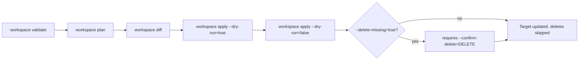
```mermaid
flowchart LR
	Validate[workspace validate] --> Plan[workspace plan]
	Plan --> Diff[workspace diff]
	Diff --> DryRun["workspace apply --dry-run=true"]
	DryRun --> Apply["workspace apply --dry-run=false"]
	Apply --> Guard{"--delete-missing=true?"}
	Guard -->|yes| Confirm["requires --confirm-delete=DELETE"]
	Guard -->|no| Done[Target updated, deletes skipped]
	Confirm --> Done
```

### REST and Console UI

Four LocaQL-only convenience endpoints, deliberately outside `/bigquery/v2/` since real BigQuery has no portable-workspace concept: paths resolve on the machine running the emulator process, the same convention already used for Load/Extract `sourceUris`/`destinationUris` — there is no file upload through the browser.

| Endpoint | Body | Notes |
|---|---|---|
| `POST /_emulator/workspace/validate` | `{"path"}` | Returns `root`, `valid`, `found`, `missingRequired`, `missingRecommended`. |
| `POST /_emulator/workspace/plan` | `{"path"}` | Returns the validation result plus the tracked-file inventory (`path`/`size`/`sha256`). |
| `POST /_emulator/workspace/diff` | `{"source", "target"}` | `target` is required (400 otherwise). Returns `onlyInSource`, `onlyInTarget`, `changed`. |
| `POST /_emulator/workspace/apply` | `{"source", "target", "dryRun", "deleteMissing", "confirmDelete"}` | `target` is required; `dryRun` defaults to `true` when omitted. A mutating (`dryRun: false`) request with `deleteMissing: true` is rejected with 400 unless `confirmDelete` is exactly `"DELETE"`. |

```bash
curl -X POST http://localhost:9050/_emulator/workspace/apply \
  -H 'Content-Type: application/json' \
  -d '{"source": "/path/to/workspace", "target": "/path/to/promoted", "dryRun": false}'
```

The console's **Workspace** tab exposes the same four operations as forms over these endpoints, rendering each response as JSON so the exact `actions`/`changed`/`missingRequired` shape is visible without leaving the browser.

## Load Jobs: Real Row Ingestion (NDJSON / CSV / Avro / Parquet)

`load` jobs materialize the destination table schema unconditionally. When `configuration.load.sourceUris` is set, the emulator also reads and ingests real rows from source files, dispatching on `sourceFormat`:

- `NEWLINE_DELIMITED_JSON`: one JSON object per line, projected onto `schema.fields` by **name**.
- `CSV`: rows mapped onto `schema.fields` by **position**; optional `fieldDelimiter` (default `,`) and `skipLeadingRows` (default `0`) are supported. Row width must match the schema field count exactly — jagged rows fail the job rather than being padded or truncated.
- `AVRO`: records read from an Avro Object Container File and projected onto `schema.fields` by **name**, same as NDJSON. The emulator does not autodetect a BigQuery schema from the file's embedded Avro schema — `schema.fields` is still required.
- `PARQUET`: rows read via [`parquet-go/parquet-go`](https://github.com/parquet-go/parquet-go) using a Parquet schema built from `schema.fields`, projected by **name** just like Avro/NDJSON. Same no-schema-autodetect limitation applies.

`sourceUris` resolve to local file paths by default (optionally prefixed with `file://`). Setting `LOCAQL_FAKE_GCS_ROOT=/some/dir` before starting the emulator makes `gs://bucket/object` URIs resolve onto `/some/dir/bucket/object` instead — a local-disk convenience mapping, **not** a GCS-compatible API. Without that env var, `gs://` is rejected explicitly.

`configuration.load.compression` (optional, default `NONE`) decompresses the source file before parsing: `GZIP` is accepted for `CSV`/`NEWLINE_DELIMITED_JSON`. Avro and Parquet already carry their own codec inside the file and are decoded transparently regardless of which one was used to write them, so `compression` is not applicable there — setting it to anything other than `NONE` for those two formats fails the job explicitly instead of silently doing nothing.

Known limitations, declared explicitly rather than silently ignored:

- Only `NEWLINE_DELIMITED_JSON`, `CSV`, `AVRO` and `PARQUET` are supported; other formats (`ORC`, the BigQuery default when `sourceFormat` is omitted) fail the job explicitly.
- `schema.fields` is required when `sourceUris` is set; there is no schema autodetect yet.
- No `maxBadRecords`/per-row error tolerance yet: any malformed row fails the whole job.
- Avro and Parquet fields are encoded as non-nullable scalars: this codebase has no NULLABLE/REQUIRED mode tracking for any format yet.

```bash
curl -X POST http://localhost:9050/bigquery/v2/projects/p1/jobs \
  -H 'Content-Type: application/json' \
  -d '{
    "configuration": {
      "load": {
        "destinationTable": {"projectId": "p1", "datasetId": "analytics", "tableId": "events"},
        "schema": {"fields": [{"name": "event_id", "type": "INT64"}, {"name": "event_name", "type": "STRING"}]},
        "sourceUris": ["/absolute/path/to/events.ndjson"],
        "sourceFormat": "NEWLINE_DELIMITED_JSON",
        "writeDisposition": "WRITE_TRUNCATE"
      }
    }
  }'
```

## Extract Jobs: Real Table Export (NDJSON / CSV / Avro / Parquet)

`extract` jobs read a real source table from the local catalog (`configuration.extract.sourceTable`) and write it to `destinationUris`, dispatching on `destinationFormat` (default `CSV` when omitted, matching the BigQuery default):

- `CSV`: `fieldDelimiter` (default `,`) and `printHeader` (default `true`, writing `schema.fields` names as the first row).
- `NEWLINE_DELIMITED_JSON`: one JSON object per row, keyed by `schema.fields` names, with `INT64`/`FLOAT64`/`BOOL` cells encoded as native JSON types rather than strings.
- `AVRO`: an Avro Object Container File with a record schema derived from `schema.fields` (`INT64`→`long`, `FLOAT64`→`double`, `BOOL`→`boolean`, else `string`).
- `PARQUET`: a Parquet file written via `parquet-go/parquet-go` using the same type mapping as Avro (`INT64`, `FLOAT64`, `BOOL`, else string).

A single `*` wildcard in `destinationUris` resolves to the BigQuery shard convention (`part-*.csv` -> `part-000000000000.csv`, `part-000000000001.csv`, ...). By default every row lands in that one shard, matching the BigQuery default of a single file when the result is small. Setting `LOCAQL_EXTRACT_SHARD_MAX_BYTES` (bytes, server-side env var, unset/`<=0` disables splitting) makes the emulator split the encoded result across multiple shard files once it exceeds that size — mirroring real BigQuery's real-size-based splitting, just with a size threshold you control locally instead of BigQuery's fixed ~1GB. A result that needs splitting requires exactly one `destinationUris` entry with a single `*`; providing a literal path (no wildcard) or more than one URI fails the job explicitly instead of silently picking one destination or writing every shard's content into the same file. The same `LOCAQL_FAKE_GCS_ROOT` mapping described above for load jobs applies to `destinationUris` too.

`configuration.extract.compression` (optional, default `NONE`) compresses the written file, with the valid codec set depending on `destinationFormat`:

| `destinationFormat` | Supported `compression` values |
| --- | --- |
| `CSV` / `NEWLINE_DELIMITED_JSON` | `NONE`, `GZIP` |
| `AVRO` | `NONE`, `SNAPPY`, `DEFLATE` (goavro's built-in OCF codecs) |
| `PARQUET` | `NONE`, `SNAPPY`, `GZIP` (`parquet-go/parquet-go`'s codec set) |

An unsupported combination (e.g. `GZIP` for `AVRO`) fails the job explicitly rather than silently falling back to uncompressed output.

Known limitations, declared explicitly rather than silently ignored:

- Only `CSV`, `NEWLINE_DELIMITED_JSON`, `AVRO` and `PARQUET` are supported as `destinationFormat`.
- `destinationUris` must be local paths, or `gs://` when `LOCAQL_FAKE_GCS_ROOT` is set; otherwise `gs://` is rejected explicitly.
- `destinationUris` with more than one `*` are rejected explicitly (only a single wildcard, resolved to one shard, is supported).
- `AVRO`'s `DEFLATE` and `PARQUET`'s `GZIP`/`SNAPPY` are the only codecs exposed; `parquet-go/parquet-go` also supports `ZSTD`/`BROTLI`/`LZ4RAW` internally but those aren't wired up as accepted `compression` values yet.

```bash
curl -X POST http://localhost:9050/bigquery/v2/projects/p1/jobs \
  -H 'Content-Type: application/json' \
  -d '{
    "configuration": {
      "extract": {
        "sourceTable": {"projectId": "p1", "datasetId": "analytics", "tableId": "events"},
        "destinationUris": ["/absolute/path/to/events_export.csv"],
        "destinationFormat": "CSV"
      }
    }
  }'
```

## Nested Schemas: STRUCT/RECORD and ARRAY/REPEATED

`schema.fields` supports real nested structure: `mode` (`NULLABLE`, the default; `REQUIRED`; or `REPEATED`) and, for a `RECORD`/`STRUCT` field, its own nested `fields` array, recursively. This is rendered end-to-end the way real BigQuery does it — `tables.get`/`tables.insert` responses, `INFORMATION_SCHEMA.COLUMNS`, `tabledata.list` and query results all reflect the real nested shape, not a flattened stand-in:

- A `RECORD` cell renders as BigQuery's actual nested row shape: `{"v": {"f": [{"v": ...}, ...]}}`.
- A `REPEATED` cell (scalar or `RECORD` base type) renders as `{"v": [{"v": ...}, ...]}`.

```bash
curl -X POST http://localhost:9050/bigquery/v2/projects/p1/jobs \
  -H 'Content-Type: application/json' \
  -d '{
    "configuration": {
      "load": {
        "destinationTable": {"projectId": "p1", "datasetId": "analytics", "tableId": "orders"},
        "schema": {"fields": [
          {"name": "order_id", "type": "INT64"},
          {"name": "items", "type": "RECORD", "mode": "REPEATED", "fields": [
            {"name": "sku", "type": "STRING"},
            {"name": "qty", "type": "INT64"}
          ]}
        ]},
        "sourceUris": ["/absolute/path/to/orders.ndjson"],
        "sourceFormat": "NEWLINE_DELIMITED_JSON"
      }
    }
  }'
```

The real [Query Engine](#query-engine-real-googlesql-via-an-embedded-sqlite-backend) materializes and returns nested columns for real (`CREATE TABLE` emits `STRUCT<...>`/`ARRAY<...>` column types), so `WHERE`/projection/`JOIN` work over a table with nested columns exactly as they do over a flat one.

`tables.patch` can evolve a schema after creation: appending new columns (which must be `NULLABLE`, since existing rows have no value for them) and relaxing an existing column from `REQUIRED` to `NULLABLE` are supported; removing a column, renaming/reordering one, changing its type, or tightening `NULLABLE` to `REQUIRED` all fail explicitly with a `400` instead of being silently applied or ignored.

Known limitations, declared explicitly:

- `NEWLINE_DELIMITED_JSON` is the only format with real nested load/extract support — JSON is naturally recursive. `CSV`, `AVRO` and `PARQUET` reject a schema containing a `RECORD`/`REPEATED` field explicitly rather than silently flattening or corrupting it. `CSV` never will support this, matching real BigQuery; `AVRO`/`PARQUET` could in principle, but that is deferred.
- A nested `RECORD` field's own sub-`fields` cannot be evolved via `tables.patch` once the table exists.
- `timePartitioning`, `rangePartitioning` and `clustering` are unrelated top-level table settings — still not implemented (see [`KNOWN-DIVERGENCES.md`](KNOWN-DIVERGENCES.md)).

## Dataset Lifecycle: Delete Contents and Undelete

`datasets.delete` requires `deleteContents=true` to remove a dataset that still has tables (matching the real BigQuery contract); without it, the request fails with a 400 naming how many tables are in the way. When `deleteContents=true` is passed, the tables tracked for that dataset are removed along with the dataset itself.

```bash
curl -X DELETE "http://localhost:9050/bigquery/v2/projects/p1/datasets/warehouse?deleteContents=true"
```

`POST /_emulator/datasets/undelete` is a **LocaQL-only convenience endpoint**, deliberately kept outside the `/bigquery/v2/` namespace: BigQuery's REST API has no public dataset-undelete contract, so this is not something a real BigQuery client would ever call. It restores a dataset's metadata (`friendlyName`, `location`, `labels`, `defaultTableExpirationMs`) from the tombstone left by the most recent delete. It never restores table contents, and it fails if a dataset with the same ID already exists or if no tombstone is found.

```bash
curl -X POST http://localhost:9070/_emulator/datasets/undelete \
  -H 'Content-Type: application/json' \
  -d '{"projectId": "p1", "datasetId": "warehouse"}'
```

## Table Expiration: defaultTableExpirationMs Enforcement

A dataset's `defaultTableExpirationMs` (a duration, in milliseconds, relative to creation time) is now enforced, not just stored. Every table created without its own explicit `expirationTime` inherits an absolute expiration computed at creation time from the dataset's default. A table can also set its own `expirationTime` (an absolute Unix-millis timestamp) via `tables.insert`/`tables.patch`/`tables.update`, which overrides the dataset default, matching real BigQuery precedence.

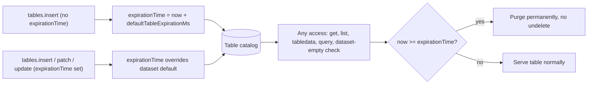
```mermaid
flowchart LR
	Insert["tables.insert (no expirationTime)"] --> Inherit["expirationTime = now + defaultTableExpirationMs"]
	InsertExplicit["tables.insert / patch / update (expirationTime set)"] --> Override[expirationTime overrides dataset default]
	Inherit --> Stored[(Table catalog)]
	Override --> Stored
	Stored --> Touch["Any access: get, list, tabledata, query, dataset-empty check"]
	Touch --> Check{now >= expirationTime?}
	Check -->|yes| Purge["Purge permanently, no undelete"]
	Check -->|no| Serve[Serve table normally]
```

Enforcement is lazy, not a background sweep: the first time an expired table is touched through any path (`tables.get`, `tables.list`, `tabledata.list`, query resolution, or the "is this dataset empty" check before a `deleteContents`-less delete), it is purged from the catalog and treated as if it never existed — permanently, with no undelete, matching real BigQuery (unlike dataset undelete, which does have a tombstone). A table ID freed by expiration can be reused immediately.

```bash
curl -X POST http://localhost:9050/bigquery/v2/projects/p1/datasets/warehouse/tables \
  -H 'Content-Type: application/json' \
  -d '{"tableReference": {"tableId": "temp_import"}, "expirationTime": "1798761600000"}'
```

Time is read through a swappable clock local to the table service (real `time.Now()` in production), which is how the test suite verifies expiration deterministically instead of sleeping in wall-clock time. This is a narrowly-scoped clock for table expiration specifically, not a project-wide injectable-clock abstraction — logging, sessions and time travel (all still unimplemented) would need their own.

## Routines and Models: Metadata CRUD

`routines` and `models` support `insert`/`get`/`list`/`patch`/`delete` under `bigquery/v2/projects/{p}/datasets/{d}/routines` and `.../models`. Both are **metadata-only**: there is no SQL execution engine behind routines and no ML training/inference backend behind models, so `definitionBody`/`routineType`/`language` and `modelType`/`friendlyName`/`description`/`labels` round-trip without ever being executed, trained, or scored. `trainingRuns` and evaluation metrics are never fabricated for models.

Routines also accept an optional `arguments` array (`[{"name": "x", "dataType": "INT64"}]`), surfaced through `INFORMATION_SCHEMA.PARAMETERS`. `dataType` is a flat scalar type name rather than real BigQuery's nested `StandardSqlDataType` (`{"typeKind": "INT64"}`) — the same flat-shape simplification already used for `schema.fields` and `externalDataConfiguration` elsewhere in this emulator. Every argument reports `parameter_mode = "IN"`; there is no execution engine to observe or enforce a real `OUT`/`INOUT` distinction for procedures.

```bash
curl -X POST http://localhost:9050/bigquery/v2/projects/p1/datasets/analytics/routines \
  -H 'Content-Type: application/json' \
  -d '{
    "routineReference": {"routineId": "add_one"},
    "routineType": "SCALAR_FUNCTION",
    "language": "SQL",
    "definitionBody": "x + 1",
    "arguments": [{"name": "x", "dataType": "INT64"}]
  }'
```

## External Tables: Query Local Files Without Loading

`tables.insert` accepts an `externalDataConfiguration` (`sourceUris`, `sourceFormat`, plus `fieldDelimiter`/`skipLeadingRows` for CSV) instead of ingesting rows into an internal table. An explicit `schema.fields` is required — there is no autodetect. The resulting table's `type` is `EXTERNAL` (a plain internal table's `type` is `TABLE`).

Unlike load jobs, **nothing is copied into the catalog at creation time**: `sourceUris` are re-read fresh from disk (or fake-GCS via `LOCAQL_FAKE_GCS_ROOT`) on every access — `SELECT`, `tabledata.list`, `INFORMATION_SCHEMA`, and using the table as a `copy`/`extract` source — so an external table always reflects the current file contents, matching real BigQuery external table semantics. If the files can't be read when data is actually requested, the request fails explicitly (a 400 for `tabledata.list`/sync queries, a job `errorResult` for async query/copy/extract jobs) rather than silently returning stale or empty data.

```bash
curl -X POST http://localhost:9050/bigquery/v2/projects/p1/datasets/analytics/tables \
  -H 'Content-Type: application/json' \
  -d '{
    "tableReference": {"tableId": "events_external"},
    "schema": {"fields": [
      {"name": "event_id", "type": "INT64"},
      {"name": "event_name", "type": "STRING"}
    ]},
    "externalDataConfiguration": {
      "sourceUris": ["/data/events.csv"],
      "sourceFormat": "CSV",
      "skipLeadingRows": 1
    }
  }'
```

Supported `sourceFormat` values are the same four covered by load/extract: `NEWLINE_DELIMITED_JSON`, `CSV`, `AVRO`, `PARQUET` (`ORC` and other formats are rejected). Deleting an external table (or its dataset) only removes the LocaQL catalog entry — the underlying file is never touched. Patching `externalDataConfiguration` after creation, autodetect, Hive partitioning, and compression options are not supported yet.

## Views and Materialized Views: Real Resources Backed by the Query Engine

`tables.insert` accepts `view.query` or `materializedView.query` instead of `schema`/`externalDataConfiguration` — mutually exclusive with each other and with `externalDataConfiguration`. The query is executed once at creation time through the real [Query Engine](#query-engine-real-googlesql-via-an-embedded-sqlite-backend), both to validate it (an invalid query, or one referencing a table that doesn't exist, fails the insert explicitly with a `400`) and to derive `schema.fields`, since a view's schema is inferred rather than user-supplied — the same way real BigQuery validates a view's SQL and infers its schema at creation.

Nothing is materialized into the view's own storage: every access — a query's `FROM`/`JOIN`, `tabledata.list`, `INFORMATION_SCHEMA.PARTITIONS` row counts — re-executes the stored query fresh, so a view always reflects the current state of whatever it selects from. This includes a view selecting from another view, resolved recursively, with a cycle guard that fails a self-referencing or circular view chain explicitly rather than recursing forever.

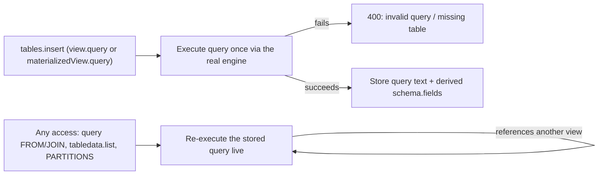
```mermaid
flowchart LR
	Insert["tables.insert (view.query or materializedView.query)"] --> Validate["Execute query once via the real engine"]
	Validate -->|fails| Reject["400: invalid query / missing table"]
	Validate -->|succeeds| Store["Store query text + derived schema.fields"]
	Access["Any access: query FROM/JOIN, tabledata.list, PARTITIONS"] --> Reexecute["Re-execute the stored query live"]
	Reexecute -->|references another view| Reexecute
```

```bash
curl -X POST http://localhost:9050/bigquery/v2/projects/p1/datasets/analytics/tables \
  -H 'Content-Type: application/json' \
  -d '{
    "tableReference": {"tableId": "high_value_orders"},
    "view": {"query": "SELECT region, amount FROM p1.analytics.orders WHERE amount > 100"}
  }'
```

`materializedView.query` is accepted the same way and rendered with `type: MATERIALIZED_VIEW`, appearing in `INFORMATION_SCHEMA.MATERIALIZED_VIEWS` rather than `VIEWS`. Known limitations, declared explicitly:

- `tables.patch`/`tables.update` cannot redefine an existing view's query yet.
- A materialized view is **not actually cached**: it is recomputed live on every access exactly like a plain view. Real BigQuery's periodic background refresh, `enableRefresh`/`refreshIntervalMs`/`lastRefreshTime` are not modeled.
- A 3-part `project.dataset.table` reference inside a view's query only resolves against the project that created the view (see [Query Engine](#query-engine-real-googlesql-via-an-embedded-sqlite-backend)).

## Sessions and Multi-Statement Transactions

`jobs.query` and `jobs.insert` (`configuration.query`) accept `createSession: true` (mints a new session, returned as `sessionInfo.sessionId`) or `connectionProperties: [{"key": "session_id", "value": "..."}]` (continues an existing one — an unknown or idle-expired session fails the request explicitly with `400`, never silently). Sessions idle-expire lazily on next use (24h default, `LOCAQL_SESSION_IDLE_TIMEOUT_SECONDS` to override for local testing).

Within a session, `` CREATE TEMP TABLE <name> AS <select> `` creates a session-scoped temporary table, referenced in later queries (in the same or a separate request, as long as they share `session_id`) as `` _SESSION.<name> ``. `BEGIN TRANSACTION` / `COMMIT TRANSACTION` / `ROLLBACK TRANSACTION` give that session's own temp tables real, atomic commit/rollback semantics.

This is deliberately **not** a thin wrapper around the query engine's native session/transaction support: a disposable investigation spike (deleted after use) found that `goccy/googlesqlite`'s own `CREATE TEMP TABLE` registration does not survive past the single call that created it — not even pinned to one connection, not even inside an already-open transaction — and its `ROLLBACK` statement fails unconditionally (`Statement not supported: RollbackStatement`). Both are real, verified upstream limitations, not a LocaQL binding issue (see [Known Divergences](KNOWN-DIVERGENCES.md) Blocking #2). Session temp tables and transactions are therefore implemented entirely in LocaQL's own code: a session's temp tables live in its own catalog, materialized into a fresh engine instance per query exactly like any other table, with `BEGIN`/`COMMIT`/`ROLLBACK` snapshotting and restoring that catalog directly.

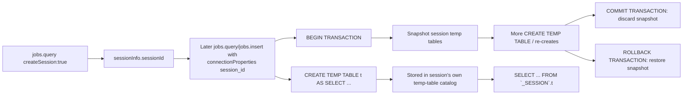
```mermaid
flowchart LR
	Create["jobs.query createSession:true"] --> SessionID["sessionInfo.sessionId"]
	SessionID --> Reuse["Later jobs.query/jobs.insert with\nconnectionProperties session_id"]
	Reuse --> CreateTemp["CREATE TEMP TABLE t AS SELECT ..."]
	CreateTemp --> Store["Stored in session's own temp-table catalog"]
	Reuse --> Begin["BEGIN TRANSACTION"]
	Begin --> Snapshot["Snapshot session temp tables"]
	Snapshot --> Mutate["More CREATE TEMP TABLE / re-creates"]
	Mutate --> Commit["COMMIT TRANSACTION: discard snapshot"]
	Mutate --> Rollback["ROLLBACK TRANSACTION: restore snapshot"]
	Store --> SelectTemp["SELECT ... FROM `_SESSION`.t"]
```

```bash
curl -X POST http://localhost:9050/bigquery/v2/projects/p1/queries \
  -H 'Content-Type: application/json' \
  -d '{"query": "SELECT 1", "createSession": true}'
# -> {"sessionInfo": {"sessionId": "session_..."}, ...}

curl -X POST http://localhost:9050/bigquery/v2/projects/p1/queries \
  -H 'Content-Type: application/json' \
  -d '{
    "query": "CREATE TEMP TABLE mytemp AS SELECT 42 AS answer",
    "connectionProperties": [{"key": "session_id", "value": "session_..."}]
  }'

curl -X POST http://localhost:9050/bigquery/v2/projects/p1/queries \
  -H 'Content-Type: application/json' \
  -d '{
    "query": "SELECT answer FROM _SESSION.mytemp",
    "connectionProperties": [{"key": "session_id", "value": "session_..."}]
  }'
```

`INFORMATION_SCHEMA.SESSIONS_BY_USER` lists the calling user's own non-expired sessions (`SESSIONS_BY_PROJECT` is not implemented — matching real BigQuery, which has no such view either, since sessions are inherently scoped to the connection/user that created them).

Known limitations, declared explicitly:

- Only the `` _SESSION.<table> `` qualified reference form resolves against a session; a bare unqualified temp table name does not.
- Only the single-statement `CREATE TEMP TABLE <name> AS <select>` form is recognized; a separate `CREATE TEMP TABLE (schema...)` followed by standalone `INSERT` statements is not.
- A session transaction's atomicity covers only that session's own temp tables — `INSERT`/`UPDATE`/`DELETE` against a real base table inside `BEGIN`/`COMMIT`/`ROLLBACK TRANSACTION` still does not mutate LocaQL's catalog at all, matching the existing, independent [Query Engine](#query-engine-real-googlesql-via-an-embedded-sqlite-backend) limitation that only `SELECT` is routed through the real engine.

## BigQuery Storage API: Real gRPC Read Sessions (Avro) and Write Streams (Protobuf)

Unlike everything else in this document, the BigQuery Storage API is a real **gRPC** service in BigQuery, not part of the JSON REST surface — so LocaQL exposes it on its own plaintext listener, separate from the REST/HTTP port, using Google's own generated protobuf/gRPC stubs (`cloud.google.com/go/bigquery/storage/apiv1/storagepb`) rather than hand-rolled message types:

```bash
locaql start --addr :9050 --storage-grpc-addr :9060
```

Like the rest of this emulator, the gRPC listener is plaintext with no TLS and no auth interceptor — the same convention Google's own local emulators (Firestore, Pub/Sub, Bigtable) already use, consistent with LocaQL's permanent anonymous-only design.

### Storage Read

`CreateReadSession` and `ReadRows` (`google.cloud.bigquery.storage.v1.BigQueryRead`) are real: column projection (`TableReadOptions.selected_fields`) and the push-down filter (`TableReadOptions.row_restriction`) are rendered as a genuine `SELECT ... WHERE ...` and executed through the same real GoogleSQL engine every other query in this project uses (see [Query Engine](#query-engine-real-googlesql-via-an-embedded-sqlite-backend)) — not a hand-rolled column/filter interpreter, so `row_restriction` gets exactly the same WHERE-clause correctness as any other query. Rows are returned Avro-framed (`AvroRows.SerializedBinaryRows`, real raw binary encoding, reusing the same Avro codec already used by [Load](#load-jobs-real-row-ingestion-ndjson--csv--avro--parquet)/[Extract](#extract-jobs-real-table-export-ndjson--csv--avro--parquet) jobs), matching the real API's message shape exactly.

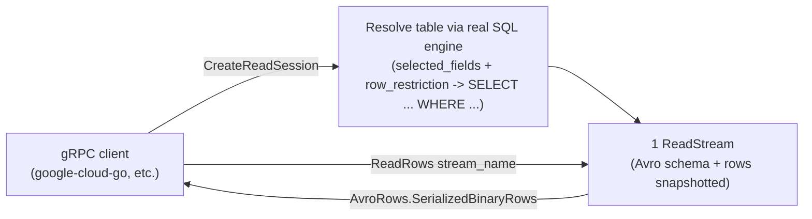
```mermaid
flowchart LR
	Client["gRPC client\n(google-cloud-go, etc.)"] -->|CreateReadSession| Session["Resolve table via real SQL engine\n(selected_fields + row_restriction -> SELECT ... WHERE ...)"]
	Session --> Stream["1 ReadStream\n(Avro schema + rows snapshotted)"]
	Client -->|ReadRows stream_name| Stream
	Stream -->|AvroRows.SerializedBinaryRows| Client
```

Deliberately bounded, confirmed with the user before building it:

- **Avro only.** Requesting Arrow framing (`arrow_serialization_options`) returns an explicit `Unimplemented` gRPC status rather than silently ignoring it or producing wrong bytes.
- **Exactly one stream per session**, regardless of `max_stream_count`/`preferred_min_stream_count`. `SplitReadStream` returns `Unimplemented` explicitly — there's nothing to split.
- **A table with a `RECORD`/`REPEATED` schema field is rejected explicitly** at `CreateReadSession` (same `rejectNestedFields` convention already used by CSV/AVRO/PARQUET load/extract), not silently flattened or corrupted.
- **Sessions never expire** — real BigQuery auto-expires a session after 6 hours; not modeled, since there's no cleanup pressure in a local, single-process emulator.

### Storage Write

`CreateWriteStream`, `AppendRows` (bidi-streaming), `GetWriteStream`, `FinalizeWriteStream` and `BatchCommitWriteStreams` (`google.cloud.bigquery.storage.v1.BigQueryWrite`) are real. Unlike Read, the Write API's rows are always **protobuf**-encoded, never Avro/Arrow: a client sends a raw `DescriptorProto` (`ProtoSchema.proto_descriptor`) once per destination, and LocaQL wraps it in a synthetic, self-contained `FileDescriptorProto`, resolves it into a real `protoreflect.MessageDescriptor`, and decodes every row through real runtime protobuf reflection (`google.golang.org/protobuf/types/dynamicpb`) — no generated Go struct or compiled `.proto` file involved on either side. Decoded fields are matched to the destination table's columns by name and appended for real.

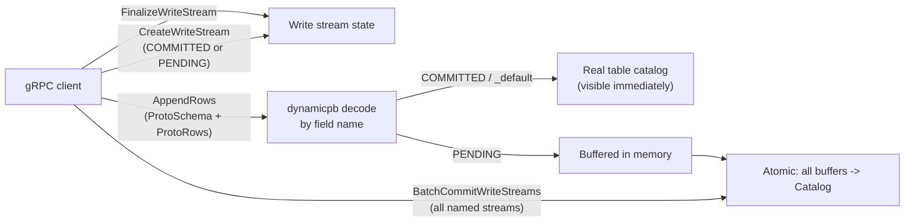
```mermaid
flowchart LR
	Client["gRPC client"] -->|"CreateWriteStream\n(COMMITTED or PENDING)"| Stream["Write stream state"]
	Client -->|"AppendRows\n(ProtoSchema + ProtoRows)"| Decode["dynamicpb decode\nby field name"]
	Decode -->|COMMITTED / _default| Catalog["Real table catalog\n(visible immediately)"]
	Decode -->|PENDING| Buffer["Buffered in memory"]
	Client -->|FinalizeWriteStream| Stream
	Client -->|"BatchCommitWriteStreams\n(all named streams)"| Commit["Atomic: all buffers -> Catalog"]
	Buffer --> Commit
```

The `_default` stream (implicit, no `CreateWriteStream` needed — every table already has one) and explicit **COMMITTED** streams append straight into the real catalog, visible immediately, reusing the same `upsertCopyDestination` helper `jobs.copy` already uses (`WRITE_APPEND` + `CREATE_NEVER` — Storage Write never creates a table, matching real BigQuery). Explicit **PENDING** streams buffer rows in server memory until `BatchCommitWriteStreams` applies every named, finalized stream's buffer to the catalog in one call — genuinely atomic (all rows from all streams land together, or none do). Explicit streams also get real offset-based exactly-once semantics: an `AppendRowsRequest.offset` behind the stream's current end returns `ALREADY_EXISTS`, ahead of it returns `OUT_OF_RANGE` — both embedded in the per-request `AppendRowsResponse`, matching the real API's own retry contract, not a top-level RPC error.

Deliberately bounded, confirmed with the user before building it:

- **BUFFERED streams are not supported.** `CreateWriteStream` with `type: BUFFERED` returns an explicit `Unimplemented` status; `FlushRows` (which only ever applies to BUFFERED streams) is likewise `Unimplemented`.
- **A repeated or nested-message proto field is rejected per row** (via `RowErrors` on that specific row, not the whole request) rather than silently flattened or corrupted; a destination table with a `RECORD`/`REPEATED` schema field is rejected even earlier, at stream creation.
- **`missing_value_interpretations` and mid-stream schema updates are not implemented** — a field absent from a given row is always `NULL`/empty, and the destination schema is read once, not re-checked mid-stream.

Verified beyond the in-memory test suite: a disposable throwaway Go client (deleted after use) drove `CreateWriteStream`/`AppendRows` over a **real TCP network connection** against a running `locaql` binary, confirming genuine wire-protocol interoperability, not just the bufconn-based unit tests.

## Fake GCS: A Real Cloud Storage JSON API, Locally

Beyond the local-disk `gs://` path mapping described above, the emulator also exposes a minimal, real-contract-compatible subset of the **Google Cloud Storage JSON API** on the same host:port as the rest of this REST surface (`:9050` by default). This lets a user's own code that already uses the official Cloud Storage client library point `STORAGE_EMULATOR_HOST` at this emulator instead of real GCS — the same "same code, different endpoint" idea this whole project is built around, just for GCS instead of BigQuery.

```bash
export STORAGE_EMULATOR_HOST=http://localhost:9050
```

Implemented, matching the real endpoint paths (verified against `cloud.google.com/go/storage`, not assumed):

| Operation | Method + path |
| --- | --- |
| `buckets.insert` | `POST /storage/v1/b` (body `{"name": "..."}`, requires `?project=`) |
| `buckets.list` | `GET /storage/v1/b?project=...` |
| `buckets.get` | `GET /storage/v1/b/{bucket}` |
| `objects.insert` (media) | `POST /upload/storage/v1/b/{bucket}/o?uploadType=media&name=...` — body is the raw object bytes |
| `objects.insert` (multipart) | `POST /upload/storage/v1/b/{bucket}/o?uploadType=multipart` — `multipart/related` body (JSON metadata part, then data part) |
| `objects.get` | `GET /storage/v1/b/{bucket}/o/{object}` |
| `objects.get` (download) | `GET /storage/v1/b/{bucket}/o/{object}?alt=media` |
| `objects.list` | `GET /storage/v1/b/{bucket}/o` (optional `?prefix=`) |
| `objects.delete` | `DELETE /storage/v1/b/{bucket}/o/{object}` |

Storage is local disk under `LOCAQL_FAKE_GCS_ROOT` (required — without it, every route above returns a `503` naming the missing env var), using the **same** bucket/object path-join convention as the `gs://` mapping used by load/extract/external tables. This means the two mechanisms interoperate: a file uploaded through this JSON API is immediately readable via a `gs://` `sourceUris` load job, and a file already sitting under `LOCAQL_FAKE_GCS_ROOT` is immediately visible through this API.

**Verified against the real client, not just this project's own tests:** running `cloud.google.com/go/storage` with `STORAGE_EMULATOR_HOST` against a live instance of this emulator confirmed `bucket.Create` and `object.NewWriter` (upload) work as-is. That test also surfaced a real, non-obvious fact: the official Go client's `NewWriter` does **not** default to the simple media upload — it sends a `multipart/related` request, which is why multipart is implemented here rather than media alone. `object.NewReader` (download) failed in that same run, but not due to a bug here: the request never reached this server at all, because the official client has a known, currently-open upstream issue where `NewReader` ignores `STORAGE_EMULATOR_HOST`/endpoint overrides and calls real GCS instead ([googleapis/google-cloud-go#1619](https://github.com/googleapis/google-cloud-go/issues/1619), filed P1). Download/get/list/delete are covered directly by this project's own test suite instead, which talks to the HTTP handlers directly and isn't affected by that client-side bug.

Explicitly **not** implemented, matching real fields/paths rather than inventing partial ones: resumable uploads (`uploadType=resumable`), IAM/ACLs, object versioning/generations, lifecycle rules, notifications, signed URLs. A resumable upload attempt fails explicitly (`501`) instead of silently mishandling the request.

## Conformance Baseline

Run the foundation conformance suite and generate reports:

```bash
wsl -d Ubuntu-24.04 -- bash -lc 'cd /mnt/f/GitHub/LocaQL && go run ./cmd/locaql conformance --base-url http://localhost:9050'
```

Reports:

- `test/conformance/reports/foundation-report.json`
- `test/conformance/reports/foundation-report.md`

Run pagination conformance suite:

```bash
wsl -d Ubuntu-24.04 -- bash -lc 'cd /mnt/f/GitHub/LocaQL && go run ./cmd/locaql conformance --base-url http://localhost:9050 --cases test/conformance/cases/pagination.yaml --report-json test/conformance/reports/pagination-report.json --report-md test/conformance/reports/pagination-report.md'
```

## Test

```bash
wsl -d Ubuntu-24.04 -- bash -lc 'cd /mnt/f/GitHub/LocaQL && go test ./...'
```

**Baseline (Sesión 86, `go test -list '.*'` counts, not hand-counted):** 214 unit tests across `internal/server` (193), `cmd/locaql` (9), `cmd/locaql-ui` (2), `internal/capabilities` (1) and `internal/workspace` (9), plus 15 more under the `e2e` build tag (see [End-to-End Console Tests](#end-to-end-console-tests)) and 7 declarative conformance cases (`test/conformance/cases/foundation.yaml` + `pagination.yaml`, see [Conformance Baseline](#conformance-baseline)). This is a point-in-time snapshot for onboarding context, not a target to keep updated by hand — `.github/workflows/ci.yml`'s `test`/`e2e` jobs are the actual source of truth for whether the suite is green today.

Validate consumer workspace layout (Delivery E baseline):

```bash
wsl -d Ubuntu-24.04 -- bash -lc 'cd /mnt/f/GitHub/LocaQL && go run ./cmd/locaql workspace validate --path .'
```

Build workspace plan and diff:

```bash
wsl -d Ubuntu-24.04 -- bash -lc 'cd /mnt/f/GitHub/LocaQL && go run ./cmd/locaql workspace plan --path .'
wsl -d Ubuntu-24.04 -- bash -lc 'cd /mnt/f/GitHub/LocaQL && go run ./cmd/locaql workspace diff --source . --target /tmp/target-workspace'
```

Preview apply actions only (no target mutations):

```bash
wsl -d Ubuntu-24.04 -- bash -lc 'cd /mnt/f/GitHub/LocaQL && go run ./cmd/locaql workspace apply --source . --target /tmp/target-workspace --dry-run=true'
```

Apply planned changes (mutating target):

```bash
wsl -d Ubuntu-24.04 -- bash -lc 'cd /mnt/f/GitHub/LocaQL && go run ./cmd/locaql workspace apply --source . --target /tmp/target-workspace --dry-run=false --manifest-out /tmp/apply-manifest.json'
```

Allow delete operations explicitly (guarded):

```bash
wsl -d Ubuntu-24.04 -- bash -lc 'cd /mnt/f/GitHub/LocaQL && go run ./cmd/locaql workspace apply --source . --target /tmp/target-workspace --dry-run=false --delete-missing=true --confirm-delete=DELETE'
```

Race validation for server concurrency:

```bash
wsl -d Ubuntu-24.04 -- bash -lc 'cd /mnt/f/GitHub/LocaQL && CGO_ENABLED=1 go test -race ./internal/server'
```

## End-to-End Console Tests

All `console.ui.*` capabilities in `capabilities/registry.yaml` are backed by real browser tests, not just code review: `cmd/locaql-ui/e2e_*_test.go` boot the real emulator and UI proxy in-process, drive them with a headless Chrome instance via [chromedp](https://github.com/chromedp/chromedp), and assert on the live DOM (form submissions, explorer tree updates, real file downloads/uploads, clipboard content, real load/extract jobs writing to disk).

These tests are gated behind the `e2e` build tag, so they never run as part of a plain `go test ./...` and never require Chrome for a normal contribution:

```bash
go test -tags e2e ./cmd/locaql-ui/...
```

That command needs a Chrome/Chromium/Edge binary reachable on the machine actually executing the test process (auto-detected via `PATH` on Linux/macOS, or common install locations on Windows). On a Linux CI runner with `google-chrome`/`chromium` preinstalled, the command above just works.

On a Windows dev machine where Go only runs inside WSL (per [Requirements](#requirements)), Chrome itself is a native Windows process, and the DevTools protocol only works within a single OS network namespace — so the test binary must be cross-compiled and executed as a native Windows binary rather than run from WSL directly:

```bash
# from WSL: cross-compile the e2e-tagged test binary for Windows
wsl -d Ubuntu-24.04 -- bash -lc 'cd /mnt/f/GitHub/LocaQL && GOOS=windows GOARCH=amd64 go test -tags e2e -c -o /tmp/e2e.exe ./cmd/locaql-ui && cp /tmp/e2e.exe /mnt/c/path/reachable/from/windows/e2e.exe'
```

```powershell
# from PowerShell, with cwd set to cmd/locaql-ui (relative paths like the registry resolve from there):
Set-Location "F:\GitHub\LocaQL\cmd\locaql-ui"
& "C:\path\reachable\from\windows\e2e.exe" "-test.v"
```

## LocaQL Console (Standalone UI)

Run the emulator first:

```bash
wsl -d Ubuntu-24.04 -- bash -lc 'cd /mnt/f/GitHub/LocaQL && go run ./cmd/locaql start --addr :9050'
```

Run the UI service on a separate port:

```bash
wsl -d Ubuntu-24.04 -- bash -lc 'cd /mnt/f/GitHub/LocaQL && go run ./cmd/locaql-ui --addr :9070 --emulator http://localhost:9050'
```

Open:

- `http://localhost:9070`

### Console Architecture

The browser only ever talks to `locaql-ui`; the emulator is reached exclusively through the `/api` proxy, so the browser never opens a direct connection to `:9050`.

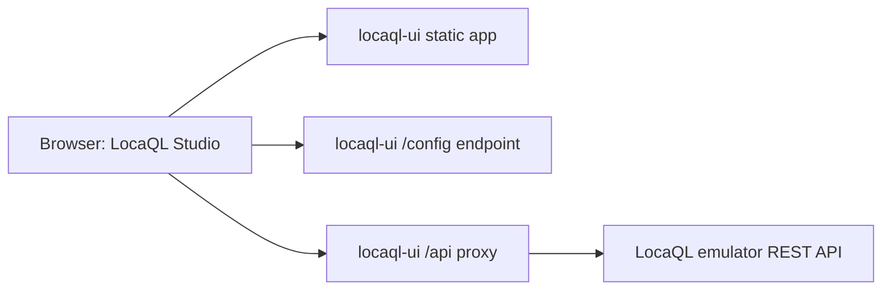
```mermaid
flowchart LR
	Browser[Browser: LocaQL Studio] --> UIStatic[locaql-ui static app]
	Browser --> UIConfig[locaql-ui /config endpoint]
	Browser --> UIProxy[locaql-ui /api proxy]
	UIProxy --> Emulator[LocaQL emulator REST API]
```

UI notes:

- The UI is a separate service and does not access emulator internals directly.
- The UI integrates dynamically through `/_emulator/capabilities` and REST APIs.
- The UI backend proxies `/api/*` to the emulator to avoid browser CORS issues.
- Default UI port: `9070`.

Current UI scope:

- Studio-style layout with navigation, a resource Explorer, and a tabbed workspace (Query, Jobs, Load / Extract, Capabilities).
- Explorer with a hierarchical Project > Dataset > Table tree, local resource search, and capability-status badges (`SUPPORTED`, `PARTIAL`, `UNSUPPORTED`, `CONTEXT`) with a persisted filter and legend. Dataset and Table nodes additionally show a smaller `UI ...` badge reflecting the console-only `console.ui.*` registry entry for that resource; it is informational (tooltip shows the underlying `reason`) and is not counted by the capability filter, which reflects REST capability only.
- Real `Routines` and `Models` nodes in the Explorer tree, wired to the emulator's metadata CRUD endpoints (see [Routines and Models: Metadata CRUD](#routines-and-models-metadata-crud)): sidebar forms create a routine (type, language, `definitionBody`, optional `arguments` JSON) or a model (`modelType`) under a dataset, and selecting a node opens a resource details panel with raw JSON, a `friendlyName`/`description` editor, and delete.
- Dataset create/update/delete (with labels and `defaultTableExpirationMs` editing), plus a **Dataset Undelete** form that restores a soft-deleted dataset's metadata from its tombstone (see [Dataset Lifecycle: Delete Contents and Undelete](#dataset-lifecycle-delete-contents-and-undelete)); deleting a non-empty dataset surfaces the backend's `deleteContents` requirement and offers to retry with it. A selected-dataset summary panel (ID, friendly name, location, table count, labels) adds quick actions to draft a dataset query, draft a table listing query, or copy the dataset ID.
- Table creation and metadata patch (`friendlyName`, `description`, labels), with a table details panel offering Schema, Preview, and JSON tabs plus query, copy-job, and delete actions.
- **External table creation** (schema.fields, `sourceUris`, source format — NDJSON/CSV/AVRO/PARQUET, CSV field delimiter/skip rows) alongside native table creation (see [External Tables](#external-tables-query-local-files-without-loading)); the table details panel shows `Type: EXTERNAL` plus an External Data Configuration block, and the Explorer tree marks external tables with an `(external)` suffix. Preview/query/copy/extract read the same live file contents an API client would see.
- **Load / Extract tab**: submit real Load jobs (`sourceUris`, schema fields, source format — NDJSON/CSV/AVRO/PARQUET, write disposition, CSV field delimiter and skip-leading-rows, optional `compression`) and real Extract jobs (`destinationUris`, destination format, CSV field delimiter, `printHeader`, optional `compression`) directly from forms, backed by the same `jobs.insert` executors described in [Load Jobs](#load-jobs-real-row-ingestion-ndjson--csv--avro--parquet) and [Extract Jobs](#extract-jobs-real-table-export-ndjson--csv--avro--parquet); each submission shows the immediate job-creation response and points to the Jobs tab for final `DONE`-state statistics. The form does not expose multi-shard extract splitting (`LOCAQL_EXTRACT_SHARD_MAX_BYTES`) since that is a server-side env var, not a per-job field.
- SQL editor with keyboard shortcuts (`Ctrl+Enter` to run, `Ctrl`/`Cmd+S` to save) and query submission as async jobs.
- Query results panel with Table, JSON, and Execution Details tabs.
- Jobs Explorer with personal/project history tabs, selection, detail refresh, and cancellation.
- Saved Queries stored in the browser (`localStorage`) with local version history, JSON import/export, and shareable URL links.
- Persistent Dark/Light theme toggle.

## Building and Releasing

`locaql` and `locaql-ui` are both fully static, dependency-free binaries — every dependency this emulator actually needs at runtime (`goccy/googlesqlite`, `google.golang.org/grpc`, etc.) is pure Go, and `locaql-ui`'s web assets are embedded via `go:embed`, so a built binary is self-contained with no separate asset directory to ship alongside it.

```bash
make build          # host platform, into ./dist
make build-all       # linux/darwin/windows × amd64/arm64, into ./dist/<os>_<arch>/
make test            # go test ./...
make vet             # go vet ./...
```

Version, commit, and build date are injected at build time via `-ldflags` (from `git describe`/`git rev-parse` when `VERSION`/`COMMIT` aren't set explicitly) and surfaced at `GET /_emulator/version`:

```bash
curl http://localhost:9050/_emulator/version
# {"name":"LocaQL","version":"v0.2.0","commit":"a1b2c3d","buildDate":"2026-07-26T18:00:00Z"}
```

A plain `go run`/`go build` with no `-ldflags` (ordinary local development, unaffected by any of this) still reports the same defaults as before this became overridable (`0.1.0-dev`/`none`/`unknown`).

### Container image

```bash
make docker-build    # builds locaql:<version> and locaql:latest
make docker-run       # runs it, publishing :9050 (REST) and :9060 (Storage API gRPC)
```

The `Dockerfile` is a multi-stage build: a `golang:1.25` builder stage (`CGO_ENABLED=0`, matching `make build`) producing a static binary, copied into a minimal, non-root `gcr.io/distroless/static-debian12:nonroot` final image alongside `capabilities/registry.yaml` (the registry path the container's entrypoint passes explicitly, since the image has no other copy of the repo to resolve a relative path against). Only `locaql` (the emulator) is containerized — `locaql-ui` is a local dev-console tool normally run directly on the developer's machine, not typically deployed as its own container.

### Release notes

[`CHANGELOG.md`](CHANGELOG.md) is the curated, user-facing summary of what changed release to release, in [Keep a Changelog](https://keepachangelog.com/en/1.1.0/) format — distinct from `devlog.md` (gitignored, not published), which is this project's full internal session-by-session build log. See `CHANGELOG.md`'s own "How releases are cut" section for the exact process.

## Continuous Integration

Every push and pull request to `main`/`dev` runs [`.github/workflows/ci.yml`](.github/workflows/ci.yml), which wires up exactly the checks already described above (and in [`CONTRIBUTING.md`](CONTRIBUTING.md#pull-request-process)) instead of relying on them being run by hand:

| Job | Runs on | What it does |
| --- | --- | --- |
| `test` | ubuntu-latest | `go build ./...`, `go vet ./...`, `go test ./...`, `CGO_ENABLED=1 go test -race ./internal/server` |
| `e2e` | ubuntu-latest | `go test -tags e2e ./cmd/locaql-ui/...` against the Chrome preinstalled on GitHub's Linux runner image (see [End-to-End Console Tests](#end-to-end-console-tests)) |
| `native` | windows-latest, macos-latest | `go build`/`go vet`/`go test ./...` natively on each OS; `go test` is `continue-on-error` (see below) |
| `cross-build` | ubuntu-latest (5-way matrix) | `CGO_ENABLED=0 go build` for `locaql`/`locaql-ui` across every `make build-all` target: `linux/amd64`, `linux/arm64`, `windows/amd64`, `darwin/amd64`, `darwin/arm64` |
| `license-scan` | ubuntu-latest | [`go-licenses`](https://github.com/google/go-licenses) `check`/`csv` over the full dependency tree; fails on a forbidden (copyleft) license, uploads the per-dependency CSV as a build artifact |

The `license-scan` job pins `go-licenses` to `v1.0.0` rather than `@latest`: at the time this was written, `@latest` fails on every package that imports anything from the standard library (`mime/multipart`, `io/ioutil`, `flag`, ...) with `"does not have module info"` and exits nonzero before producing any report — a confirmed, still-open upstream regression ([google/go-licenses#128](https://github.com/google/go-licenses/issues/128)), not something specific to this project. Two indirect dependencies (`github.com/ncruces/go-sqlite3-wasm/v2`, `modernc.org/mathutil`) have no `LICENSE`/`COPYING`/`README`/`NOTICE` file discoverable in their module cache copy, so the scan reports them as `Unknown` rather than guessing — worth a manual look if you're auditing licenses closely, not a build failure.

**`native`'s `go test ./...` step is `continue-on-error`, not a passing check**: this CI job is the first time this project's test suite has ever actually run on native Windows or macOS (development has always happened through WSL/Linux, per [Requirements](#requirements)), and it surfaced a real, previously-unknown limitation — see [Known Divergences](KNOWN-DIVERGENCES.md) for the full detail. `go build`/`go vet` are unaffected and still block on failure.

## Contributing

Issues and pull requests are welcome. See [`CONTRIBUTING.md`](CONTRIBUTING.md) for the branching model (`feature`/`fix`/`docs`/`chore`/`hotfix` → `dev` → `main`), commit conventions, the pull request checklist, and exactly who can approve and merge into `main`/`dev` (branch protection is enforced via a GitHub ruleset + [`CODEOWNERS`](.github/CODEOWNERS): any PR needs the code owner's approval, and only the repository owner can bypass that requirement). Significant, hard-to-reverse design decisions are recorded in [`docs/adr/`](docs/adr/README.md).

## License

LocaQL is licensed under the [Apache License, Version 2.0](LICENSE). Read [`NOTICE`](NOTICE) before using, deploying, modifying, or forking this project: it explains the attribution you must carry forward into any derivative work, and clarifies that LocaQL is not affiliated with Google or BigQuery.
