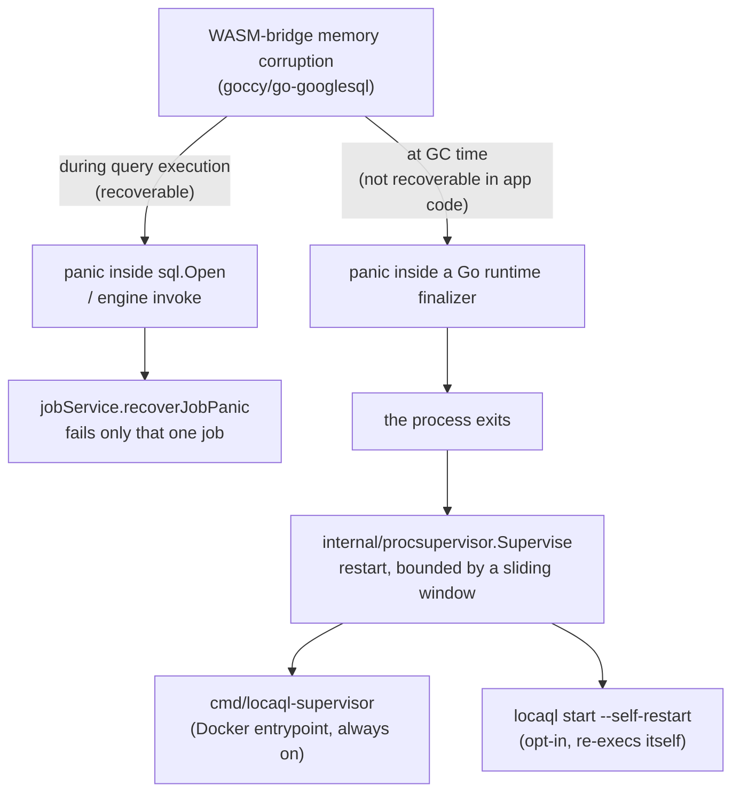

# Benchmarks

This document has two parts: this project's own reproducible performance
benchmarks, and a reliability finding this same benchmarking work
surfaced — a real, previously unknown crash condition, disclosed here in
full rather than quietly worked around, in keeping with this project's
[`KNOWN-DIVERGENCES.md`](../KNOWN-DIVERGENCES.md) philosophy of publishing
what's actually true rather than what's convenient.

## Methodology

[`cmd/locaql-bench`](../cmd/locaql-bench) is a small, dependency-free HTTP
client that drives identical REST workloads against **any**
BigQuery-REST-compatible server over the network — the same methodology
this project already applies to correctness (one divergence catalog,
evidence-based) applied to performance instead.

Workloads, run sequentially against a freshly started server:

- `sync_query_trivial` — `SELECT 1 AS one` (no catalog table touched).
- `sync_query_small_table` — `COUNT`/`SUM` with a `WHERE` over a 1,000-row table.
- `sync_query_join` — a `JOIN` between a 1,000-row and a 500-row table.
- `streaming_insert_single_row` — one `tabledata.insertAll` call per row.
- `streaming_insert_batch_100` — one `tabledata.insertAll` call per 100 rows.
- `concurrent_sync_queries` — the small-table `COUNT` query, fired from 6 concurrent workers.

Reproduce it yourself:

```bash
# terminal 1
go run ./cmd/locaql start --addr 127.0.0.1:19050

# terminal 2
go run ./cmd/locaql-bench --endpoint http://127.0.0.1:19050 --project bench --label LocaQL --iterations 30
```

### Environment for the results below

- CPU: Intel Core i9-10900K (6 cores allocated to the WSL2 VM)
- RAM: 31 GiB
- OS: Ubuntu 24.04 under WSL2 (Windows host)
- Go: 1.25.12
- LocaQL: commit `25dc33b` (`v0.9.2`-16 commits)
- Server freshly started, single run, `--iterations 30 --insert-iterations 300 --concurrency 6`, no other load on the machine.

Treat these as one honest data point, not a statistically rigorous benchmark suite — there is no warm-body CI runner running this repeatedly yet (see the master checklist for that as a follow-up). Numbers will vary by hardware.

## Results

| Workload | p50 | mean |
|---|---:|---:|
| `sync_query_trivial` | 201.4 ms | 201.6 ms |
| `sync_query_small_table` | 301.7 ms | 312.0 ms |
| `sync_query_join` | 402.1 ms | 402.3 ms |
| `streaming_insert_single_row` | 0.54 ms (1,856 rows/s) | 0.54 ms |
| `streaming_insert_batch_100` | 1.69 ms (60,352 rows/s) | 1.66 ms |
| `concurrent_sync_queries` (×6) | 1,304 ms | 1,304 ms |

Full JSON output is reproducible via `--json`; this table is a summary, not a substitute for running it yourself against your own hardware.

`streaming_insert_*` is fast because `tabledata.insertAll` is a direct, job-free catalog write (see [`streaming_inserts.go`](../internal/server/streaming_inserts.go)) that never touches the query engine at all. `sync_query_*` pays a per-query cost from the WASM-transpiled analyzer's own parse/type-check step, on this hardware roughly 200ms regardless of connection age (verified directly by pooling connections, see below — pooling did not change this number). `concurrent_sync_queries` shows substantial serialization under 6 concurrent workers relative to single-query latency — there is no evidence yet of good horizontal query concurrency.

## Materializing large tables: a real fix, and a real dead end

The table above uses a 1,000-row table. That hides a real, scale-dependent cost: every query re-materializes every table it references into a fresh instance of the embedded engine (see [`openMaterializedSQLDatabase`](../internal/server/sql_engine.go)), and at 50,000 rows that materialization — not the query that follows it — dominates total latency.

Profiled directly (`go test -bench BenchmarkSyncQueryLargeTable -cpuprofile=cpu.prof` in `internal/server`, then `go tool pprof -top -cum`): with a naive one-`stmt.Exec`-per-row insert loop and no explicit transaction, `materializeTable` accounted for **74% of total per-query time** at 50k rows — each row's insert was implicitly its own SQLite commit, a real, separate cost inside the WASM-transpiled engine.

**Fix that worked, measured before and after:** wrapping the whole per-table insert loop in one explicit transaction (`db.Begin()` / `tx.Commit()` around the existing prepared-statement loop) cut total query time by roughly 13-16% in repeated runs of the same benchmark — a real, if modest, win from removing one commit-per-row.

**Fix that looked obvious and made things ~5.5x *worse*, kept here instead of quietly discarded:** the natural next idea was batching many rows into one multi-row `INSERT ... VALUES (...), (...), (...)` statement, to amortize the fixed per-`Exec` cost (value encoding and type resolution inside the WASM-transpiled engine, which reprofiling showed was the actual dominant residual cost, not the per-row commit) across more rows per call. Measured directly, this made the same benchmark roughly 5.5x slower instead of faster: the engine's own parse/analyze cost for one large, complex statement (hundreds of bound parameters) scales far worse than linearly with statement size, dwarfing the per-call overhead it was meant to amortize. Reverted; `materializeTable` inserts one row per `Exec` call against a single reused prepared statement, on purpose, inside the one transaction from the fix above.

**Net result of this pass:** the transaction fix is real and kept. The larger remaining cost at scale was inherent to materializing a full table fresh, per query, inside this specific WASM-transpiled engine — reducing it further needed caching a materialized snapshot across queries, a real architectural change. That change is described next.

## Caching materialized tables across queries

Re-materializing a table on every query is wasted work whenever nothing about that table actually changed since the last time it was materialized. Every mutation path in this codebase (`INSERT`/`UPDATE`/`DELETE`/`MERGE`, streaming inserts, load/copy jobs, schema evolution) already bumps a per-table `Version` counter as its own internal bookkeeping — that gives a ready-made, already-correct signal for "has this table changed", with no new plumbing needed.

**What changed** (`internal/server/sql_engine_pool.go`, `internal/server/sql_engine.go`): a read-only query now resolves which tables it references and at which catalog version *before* acquiring an embedded-engine connection, and computes a signature from that (dataset, table, version) set. A connection whose already-materialized tables exactly match that signature is reused with no materialization at all — including a connection **another concurrent read-only query is still using**, since two queries wanting the identical, unchanged table set can safely share one materialization. A query that could mutate a base table, touches a session-scoped temp table, or had partition pruning applied, is never eligible for this — it always gets a private, exclusively-owned connection, matching this project's original behavior exactly, because none of those three cases has a stable version-keyed signature that's safe to cache (see below).

**Measured effect** (`BenchmarkSyncQueryLargeTable`, the same 50k-row/`WHERE`+aggregate shape as the profiling above, repeated queries against an otherwise-idle table — the realistic case for a dashboard or BI tool re-running a similar query): **~350ms/op**, down from ~1.2s after the transaction fix alone (and 1.43s before it) — roughly a **3.5x** reduction on top of that earlier fix, from skipping materialization entirely on a signature hit rather than just making it cheaper.

**Correctness hazards this had to be built around, each with a dedicated regression test** (`internal/server/sql_engine_cache_test.go`, `internal/server/sql_engine_pool_test.go`):

- **External tables and views never get a cache-eligible version.** An external table's `Version` never changes when its underlying file does — there is no catalog mutation to bump it — so keying a cache entry on it would silently serve stale rows after the live file changes (caught by an existing test, `TestExternalTableQueryReflectsLiveFileContents`, which failed the moment this feature's first draft ran against it). A view's `Version` likewise only changes when the view's own query text changes, not when a table it selects from does; excluding it from caching costs nothing extra, since a view's rows are always recomputed fresh regardless of this cache.
- **A partition-pruned materialization is a subset of the table, never the whole thing** — pruning disqualifies that resolution from caching entirely, so a later unfiltered read of the same table can never be served the pruned subset (`TestPartitionPrunedQueryNeverPollutesTheSharedCacheForAFullTableRead`).
- **A connection repurposed for a different signature must have every table it previously held that isn't wanted by the new signature dropped first.** The embedded engine resolves a `dataset.prefix*` wildcard query natively against its *own* catalog — not this project's — so a stale materialized table left behind on a reused connection can wrongly rejoin a later wildcard union even after this project's own catalog no longer has it (`TestWildcardCacheReconciliationDropsStaleTableFromRepurposedEngine` reproduces exactly this by deleting a table from the catalog and confirming a later wildcard query against a reused connection excludes it).
- **A mutating statement never shares a connection with a concurrent reader.** Every mutating or session-control statement always takes the private, exclusively-owned path, never the shared one — verified under `go test -race` with real concurrent goroutines mixing reads and writes against the same table (`TestConcurrentReadsAndMutationsAgainstTheSameTableStayCorrect`).

**A real concurrency bug this surfaced, and how it was found:** true concurrent sharing means multiple goroutines can legitimately call `Query`/`Exec` against the *same* embedded-engine connection at the same moment — something no previous code path in this project ever did, since every query used to get its own exclusive connection for its own duration. That exposed two separate bugs, both only reproducible under real concurrent load (`BenchmarkConcurrentSyncQueriesLargeTable`, many parallel workers running the identical query against the same 50k-row table):

1. A connection's cache signature was cleared *after* releasing the pool's internal lock instead of before, so a concurrent lookup could match a connection that was mid-teardown for a different purpose. Fixed by clearing it atomically under the same lock that decides whether a lookup matches.
2. Once (1) was fixed, the benchmark still failed intermittently with `no such table`, this time from inside the embedded engine itself: `goccy/go-googlesql`'s own catalog object is shared by every driver-level connection opened against one `*sql.DB` (which is what makes reuse safe at all), but that shared catalog is not itself safe for *concurrent* access — two goroutines legitimately holding the same shared connection and calling into the driver at the same moment can race inside it. Worked around by capping each pooled connection to exactly one underlying driver connection (`db.SetMaxOpenConns(1)`), which makes Go's own `database/sql` serialize access to it — concurrent holders queue for their turn at the driver instead of ever entering it simultaneously. This does not defeat the point of sharing: the expensive part (materializing rows) still happens once per signature, not once per concurrent reader; only the final SQL execution itself is serialized. With the fix in place, the same benchmark run — under `go test -race`, many parallel workers, hundreds of iterations — passes cleanly.

**Measured concurrent-load effect** (`BenchmarkConcurrentSyncQueriesLargeTable`, 8 parallel workers running the identical query against the 50k-row table): **~186ms/op**, lower than even the single-worker warm-cache number above, since concurrent workers overlap their queued driver turns with other work instead of running fully sequentially.

## A crash found by sustained load, not hidden

Running this benchmark tool repeatedly against one long-lived LocaQL process (roughly 250–350 cumulative queries in our testing — the exact count is not deterministic) reproduced a **real process crash**, on Linux/WSL — the platform this project documents as officially supported (unlike the already-known native Windows/macOS WASM trap, [`KNOWN-DIVERGENCES.md`](../KNOWN-DIVERGENCES.md) Blocking #2, which this is *not*).

**Root cause, as far as we could isolate it without modifying third-party code:** the embedded engine's WASM bridge (`goccy/go-googlesql` → `goccy/googlesqlite`) can panic with a memory-corruption-shaped `runtime error: slice bounds out of range` from *inside* `database/sql.Open` itself, after enough sequential/concurrent engine instances have been opened and closed over a long-running process's lifetime. We added `jobService.recoverJobPanic` ([`jobs_service.go`](../internal/server/jobs_service.go)) so a panic during query *execution* fails only that one job instead of taking the whole process down — verified with a dedicated regression test ([`panic_recovery_test.go`](../internal/server/panic_recovery_test.go)) and confirmed in this same load-testing session: two such panics were caught and turned into ordinary failed jobs, and the server kept serving requests afterward.

**That fix is real but not complete.** Continuing the same load, the process eventually still crashed — this time from a panic inside a **Go runtime finalizer** (`runtime.runFinalizers` → `(*SimpleCatalog).free`), on a dedicated runtime-managed goroutine that no `defer`/`recover` in application code can reach, because it isn't part of any request's call stack. This is the same underlying WASM corruption, surfacing at Go's own garbage-collection cleanup step instead of at query-execution time. There is no mitigation available from LocaQL's own code for this specific failure mode — it would require a fix in `goccy/go-googlesql`'s WASM memory management itself.

We searched `goccy/googlesqlite` and `goccy/go-googlesql`'s issue trackers and found no existing report matching this signature; as far as we can tell, this is a new finding, not a rediscovery of documented behavior.

**What we shipped instead of just documenting it:**

- **Connection pooling** (`internal/server/sql_engine_pool.go`): embedded-engine instances are reused across queries instead of opening a fresh one every time. This was our first hypothesis for the crash's root cause — measured at the time, reuse alone did **not** reduce per-query latency (the ~200ms cost was not `sql.Open` itself) and did **not** fully prevent the crash either: the corruption reproduces at roughly the same cumulative query count regardless of how many distinct connections were involved, which points to shared state inside the WASM bridge's own runtime module rather than something scoped per connection. Kept anyway at the time because it's a real, measured reduction in `sql.Open` call volume with no downside. This same pool was later extended to also cache materialized tables across queries by signature, which *does* substantially cut latency for repeated queries — see "Caching materialized tables across queries" above; that extension is a separate change from, and unrelated to, this crash finding.
- **Automatic process recovery** (`internal/procsupervisor.Supervise`): since the crash can't be prevented from inside the process, a supervised child now restarts automatically on an unexpected exit, bounded by a sliding-window limit (so an unrelated, persistent problem still fails loudly instead of crash-looping forever). This is the same pattern long-running worker processes have used for exactly this class of problem for decades (Unicorn/Puma worker recycling, PHP-FPM's `max_requests`). `cmd/locaql-supervisor` applies it to the emulator process it manages; `locaql start --self-restart` applies the identical mechanism to itself, re-executing as a supervised child, for deployments that run the bare binary directly. Verified with real child-process tests (`internal/procsupervisor/procsupervisor_test.go`, `cmd/locaql/start_self_restart_test.go`): the restart loop recovers from repeated crashes, still gives up correctly past the bound, and — for the self-restart path — recovers through a real re-exec of the actual binary rather than just a generic stand-in process.



**Practical takeaway:** running via `locaql-supervisor` (the Docker image's entrypoint), the service stays available through this failure mode — the emulator process recycles automatically instead of taking the container down. Running the bare `locaql` binary directly also has this protection now, opt-in: `locaql start --self-restart` re-execs itself as a supervised child and restarts automatically on an unexpected exit, using the same bounded-restart mechanism (`internal/procsupervisor`) as `locaql-supervisor`. Without `--self-restart` (the default), a direct `locaql start` still has no protection against this specific crash.

## Soak testing the restart loop

`cmd/locaql-bench --soak-duration <duration>` replaces the normal one-shot workload report with an indefinite load loop: concurrent workers hammer `SELECT 1 AS one` (no dataset/table dependency, since a supervised restart wipes a non-persistent process's catalog) for the given wall-clock duration, tracking not just error counts but *outage shape* — how many distinct periods of continuous failure occurred (each one a restart cycle, if the target is supervised) and how long the longest one lasted. `--soak-max-outage` (default 60s) fails the run immediately if the server is ever down longer than that continuously — the one outcome that would mean the mitigation itself has regressed, as opposed to the known crash simply happening again and recovering.

```bash
# terminal 1
go run ./cmd/locaql start --addr 127.0.0.1:19050 --self-restart

# terminal 2
go run ./cmd/locaql-bench --endpoint http://127.0.0.1:19050 --soak-duration 20m --soak-concurrency 6 --json soak-report.json
```

`.github/workflows/soak-test.yml` runs this same tool against a `locaql start --self-restart` process for a configurable duration (`workflow_dispatch` input, default 20 minutes) — manual-only rather than on every push, since it deliberately sustains load for minutes rather than seconds. It uploads the JSON report and full server log as artifacts. The crash is not deterministic — a given run may see zero, one, or several occurrences — so the job does not require it to happen to pass; it only requires that the server recovers within the outage bound every time it does. This is the "confirm the restart loop holds up over many cycles" validation that a one-off manual reproduction can't provide.

## Future work

- **Extend coverage** to load/extract throughput and BigQuery Storage API read/write paths, which this first pass didn't cover.
