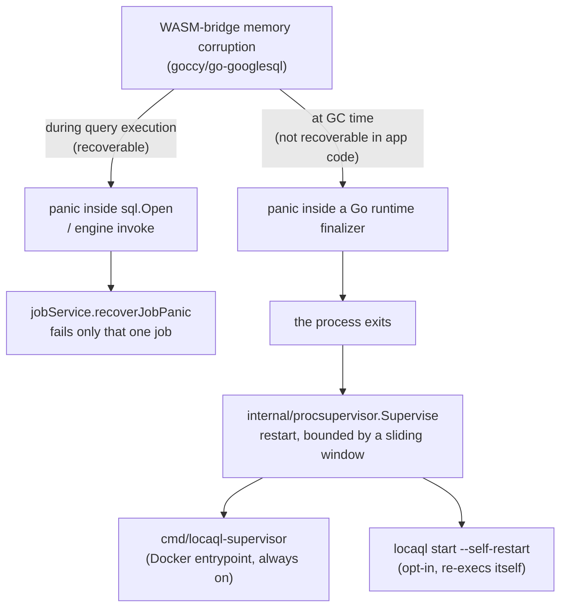

# Benchmarks

This document has two parts: a reproducible performance comparison against
[`goccy/bigquery-emulator`](https://github.com/goccy/bigquery-emulator), and
a reliability finding this same benchmarking work surfaced — a real,
previously unknown crash condition, disclosed here in full rather than
quietly worked around, in keeping with this project's
[`KNOWN-DIVERGENCES.md`](../KNOWN-DIVERGENCES.md) philosophy of publishing
what's actually true rather than what's convenient.

## Methodology

[`cmd/locaql-bench`](../cmd/locaql-bench) is a small, dependency-free HTTP
client that drives identical REST workloads against **any**
BigQuery-REST-compatible server. The same binary produced every number
below for both LocaQL and goccy — not two separately hand-tuned scripts —
by pointing `--endpoint` at each server in turn. This is the same
methodology this project already applies to correctness (one divergence
catalog, evidence-based) applied to performance instead.

Workloads, run sequentially against a freshly started server for each
target:

- `sync_query_trivial` — `SELECT 1 AS one` (no catalog table touched).
- `sync_query_small_table` — `COUNT`/`SUM` with a `WHERE` over a 1,000-row table.
- `sync_query_join` — a `JOIN` between a 1,000-row and a 500-row table.
- `streaming_insert_single_row` — one `tabledata.insertAll` call per row.
- `streaming_insert_batch_100` — one `tabledata.insertAll` call per 100 rows.
- `concurrent_sync_queries` — the small-table `COUNT` query, fired from 6 concurrent workers.

Reproduce it yourself:

```bash
# terminal 1
go run ./cmd/locaql start --addr 127.0.0.1:19050

# terminal 2 (goccy, built separately: go install github.com/goccy/bigquery-emulator/cmd/bigquery-emulator@latest)
bigquery-emulator --project=bench --port=19051 --grpc-port=19061

# terminal 3
go run ./cmd/locaql-bench --endpoint http://127.0.0.1:19050 --project bench --label LocaQL --iterations 30
go run ./cmd/locaql-bench --endpoint http://127.0.0.1:19051 --project bench --label goccy   --iterations 30
```

### Environment for the results below

- CPU: Intel Core i9-10900K (6 cores allocated to the WSL2 VM)
- RAM: 31 GiB
- OS: Ubuntu 24.04 under WSL2 (Windows host)
- Go: 1.25.12
- LocaQL: commit `25dc33b` (`v0.9.2`-16 commits)
- `goccy/bigquery-emulator`: `v0.8.1`
- Both servers freshly started, single run each, `--iterations 30 --insert-iterations 300 --concurrency 6`, no other load on the machine.

Treat these as one honest data point, not a statistically rigorous benchmark suite — there is no warm-body CI runner running this repeatedly yet (see the master checklist for that as a follow-up). Numbers will vary by hardware; the *shape* of the differences (where below) is the more durable takeaway.

## Results

| Workload | LocaQL p50 | LocaQL mean | goccy p50 | goccy mean | Winner |
|---|---:|---:|---:|---:|---|
| `sync_query_trivial` | 201.4 ms | 201.6 ms | 175.0 ms | 185.5 ms | goccy |
| `sync_query_small_table` | 301.7 ms | 312.0 ms | 210.4 ms | 201.9 ms | goccy |
| `sync_query_join` | 402.1 ms | 402.3 ms | 299.4 ms | 306.3 ms | goccy |
| `streaming_insert_single_row` | 0.54 ms (1,856 rows/s) | 0.54 ms | 224.97 ms (4 rows/s) | 228.4 ms | **LocaQL, ~400x** |
| `streaming_insert_batch_100` | 1.69 ms (60,352 rows/s) | 1.66 ms | 283.5 ms (345 rows/s) | 289.6 ms | **LocaQL, ~170x** |
| `concurrent_sync_queries` (×6) | 1,304 ms | 1,304 ms | 1,433 ms | 1,352 ms | roughly tied |

Full JSON output for both runs is reproducible via `--json`; this table is the summary, not a substitute for running it yourself against your own hardware.

### Reading this honestly

**goccy is faster per query, by a real and consistent margin (~15–35%).** The ~200ms paid per query on this hardware is *not* `sql.Open` overhead — we verified this directly by pooling connections (see below) and measuring no latency change — so it's most likely the WASM-transpiled analyzer's own per-statement parse/type-check cost, paid on every query regardless of connection age. Closing this gap would need a change inside the query-analysis path itself, not a connection-management change; not attempted here.

**LocaQL's streaming inserts (`tabledata.insertAll`) are dramatically faster** — roughly 170–400x depending on batch size. This isn't a fluke either: LocaQL's `insertAll` is a direct, job-free catalog write (see [`streaming_inserts.go`](../internal/server/streaming_inserts.go)) that never touches the query engine at all, while every millisecond of goccy's ~225–290ms per call suggests its write path goes through the same per-call engine-startup cost its queries do. If your workload is insert-heavy (loading fixtures, seeding test data, streaming-ingest pipelines), this is a large, real, reproducible advantage.

**Concurrent query throughput is roughly comparable, and not good for either emulator** at this concurrency level — both show substantial serialization under 6 concurrent queries relative to their own single-query latency. Neither project currently has evidence of good horizontal query concurrency; this is a fair fight, not a LocaQL weakness relative to goccy specifically.

## A crash found by benchmarking, not hidden

Running this same benchmark repeatedly against one long-lived LocaQL process (roughly 250–350 cumulative queries in our testing — the exact count is not deterministic) reproduced a **real process crash**, on Linux/WSL — the platform this project documents as officially supported (unlike the already-known native Windows/macOS WASM trap, [`KNOWN-DIVERGENCES.md`](../KNOWN-DIVERGENCES.md) Blocking #2, which this is *not*).

**Root cause, as far as we could isolate it without modifying third-party code:** the embedded engine's WASM bridge (`goccy/go-googlesql` → `goccy/googlesqlite`) can panic with a memory-corruption-shaped `runtime error: slice bounds out of range` from *inside* `database/sql.Open` itself, after enough sequential/concurrent engine instances have been opened and closed over a long-running process's lifetime. We added `jobService.recoverJobPanic` ([`jobs_service.go`](../internal/server/jobs_service.go)) so a panic during query *execution* fails only that one job instead of taking the whole process down — verified with a dedicated regression test ([`panic_recovery_test.go`](../internal/server/panic_recovery_test.go)) and confirmed in this same benchmarking session: two such panics were caught and turned into ordinary failed jobs, and the server kept serving requests afterward.

**That fix is real but not complete.** Continuing the same load, the process eventually still crashed — this time from a panic inside a **Go runtime finalizer** (`runtime.runFinalizers` → `(*SimpleCatalog).free`), on a dedicated runtime-managed goroutine that no `defer`/`recover` in application code can reach, because it isn't part of any request's call stack. This is the same underlying WASM corruption, surfacing at Go's own garbage-collection cleanup step instead of at query-execution time. There is no mitigation available from LocaQL's own code for this specific failure mode — it would require a fix in `goccy/go-googlesql`'s WASM memory management itself.

We searched `goccy/googlesqlite` and `goccy/go-googlesql`'s issue trackers and found no existing report matching this signature; as far as we can tell, this is a new finding, not a rediscovery of documented behavior.

**What we shipped instead of just documenting it:**

- **Connection pooling** (`internal/server/sql_engine_pool.go`): embedded-engine instances are reused across queries instead of opening a fresh one every time. This was our first hypothesis for the crash's root cause — measured directly, it did **not** reduce per-query latency (the ~200ms cost is not `sql.Open` itself) and did **not** fully prevent the crash either: the corruption reproduces at roughly the same cumulative query count regardless of how many distinct connections were involved, which points to shared state inside the WASM bridge's own runtime module rather than something scoped per connection. Kept anyway because it's a real, measured reduction in `sql.Open` call volume with no downside, verified against the same correctness suite (including a real bug it exposed and fixed: a reused connection could otherwise inherit a stale table from an earlier, unrelated query).
- **Automatic process recovery** (`internal/procsupervisor.Supervise`): since the crash can't be prevented from inside the process, a supervised child now restarts automatically on an unexpected exit, bounded by a sliding-window limit (so an unrelated, persistent problem still fails loudly instead of crash-looping forever). This is the same pattern long-running worker processes have used for exactly this class of problem for decades (Unicorn/Puma worker recycling, PHP-FPM's `max_requests`). `cmd/locaql-supervisor` applies it to the emulator process it manages; `locaql start --self-restart` applies the identical mechanism to itself, re-executing as a supervised child, for deployments that run the bare binary directly. Verified with real child-process tests (`internal/procsupervisor/procsupervisor_test.go`, `cmd/locaql/start_self_restart_test.go`): the restart loop recovers from repeated crashes, still gives up correctly past the bound, and — for the self-restart path — recovers through a real re-exec of the actual binary rather than just a generic stand-in process.



**Practical takeaway:** running via `locaql-supervisor` (the Docker image's entrypoint), the service stays available through this failure mode — the emulator process recycles automatically instead of taking the container down. Running the bare `locaql` binary directly also has this protection now, opt-in: `locaql start --self-restart` re-execs itself as a supervised child and restarts automatically on an unexpected exit, using the same bounded-restart mechanism (`internal/procsupervisor`) as `locaql-supervisor`. Without `--self-restart` (the default), a direct `locaql start` still has no protection against this specific crash.

## Future work

- **A soak-test CI job** that runs this same benchmark tool in a loop for an extended period, to get a real, repeatable crash-time distribution instead of the one anecdotal data point in this document — and to confirm the restart loop holds up over many cycles, not just the two or three reproduced manually here.
- **Extend the comparison** to load/extract throughput and BigQuery Storage API read/write paths, which this first pass didn't cover.
